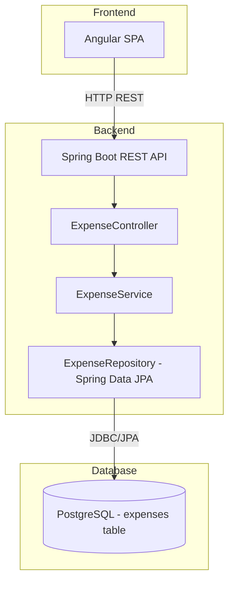
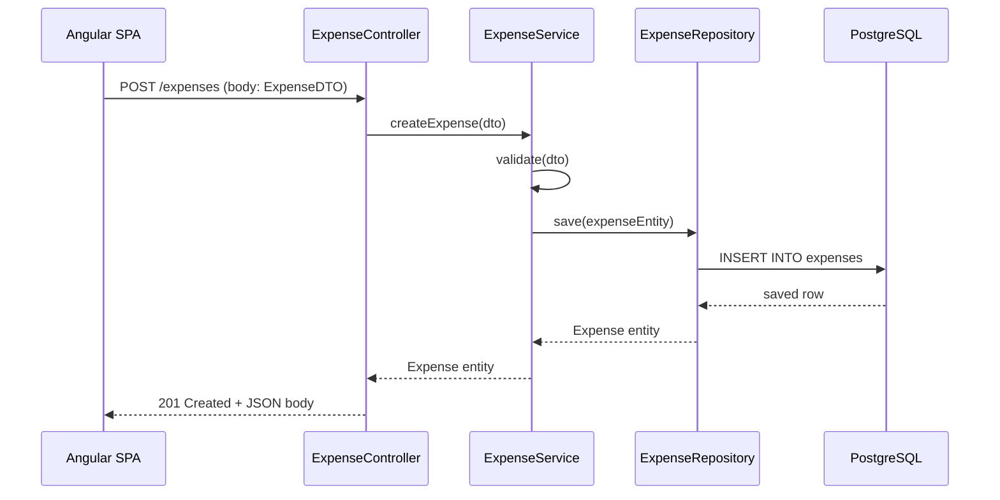
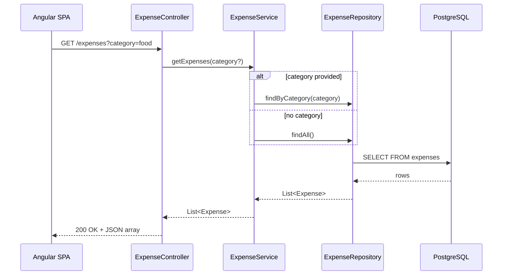
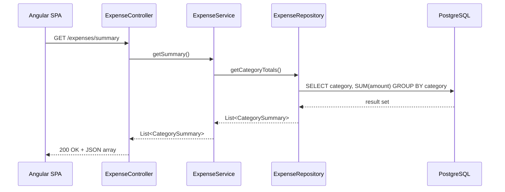

# Design Document: Budget Tracker

## Overview

Budget Tracker is a full-stack expense tracking application that allows users to create, view, update, and delete expenses, filter them by category, and view spending summaries grouped by category. The backend is a Spring Boot REST API backed by PostgreSQL, and the frontend is an Angular single-page application.

The system follows a straightforward three-tier architecture: Angular SPA → Spring Boot REST API → PostgreSQL database. There is no authentication, pagination, or complex UI framework beyond Angular Material defaults. The goal is simplicity and clarity.

## Architecture



## Sequence Diagrams

### Create Expense



### List Expenses (with optional category filter)



### Get Summary



## Components and Interfaces

### Component 1: ExpenseController (REST Layer)

**Purpose**: Expose HTTP endpoints for CRUD operations and summary queries.

**Interface**:
```java
@RestController
@RequestMapping("/expenses")
public class ExpenseController {

    @PostMapping
    ResponseEntity<ExpenseDTO> createExpense(@Valid @RequestBody ExpenseCreateDTO dto);

    @GetMapping
    ResponseEntity<List<ExpenseDTO>> getExpenses(@RequestParam(required = false) String category);

    @PutMapping("/{id}")
    ResponseEntity<ExpenseDTO> updateExpense(@PathVariable Long id, @Valid @RequestBody ExpenseCreateDTO dto);

    @DeleteMapping("/{id}")
    ResponseEntity<Void> deleteExpense(@PathVariable Long id);

    @GetMapping("/summary")
    ResponseEntity<List<CategorySummaryDTO>> getSummary();
}
```

**Responsibilities**:
- Request validation via `@Valid`
- Delegate to service layer
- Return appropriate HTTP status codes
- Handle path/query parameters

### Component 2: ExpenseService (Business Logic)

**Purpose**: Encapsulate business rules and orchestrate data access.

**Interface**:
```java
@Service
public class ExpenseService {

    Expense createExpense(ExpenseCreateDTO dto);

    List<Expense> getExpenses(String category);

    Expense updateExpense(Long id, ExpenseCreateDTO dto);

    void deleteExpense(Long id);

    List<CategorySummary> getSummary();
}
```

**Responsibilities**:
- Validate business constraints (amount > 0, required fields)
- Map between DTOs and entities
- Throw appropriate exceptions for not-found cases
- Delegate persistence to repository

### Component 3: ExpenseRepository (Data Access)

**Purpose**: Spring Data JPA repository for the expenses table.

**Interface**:
```java
@Repository
public interface ExpenseRepository extends JpaRepository<Expense, Long> {

    List<Expense> findByCategory(String category);

    @Query("SELECT new com.budgettracker.dto.CategorySummary(e.category, SUM(e.amount)) " +
           "FROM Expense e GROUP BY e.category")
    List<CategorySummary> getCategoryTotals();
}
```

**Responsibilities**:
- Standard CRUD via JpaRepository
- Custom query for category filtering
- Aggregation query for summary

### Component 4: Angular ExpenseService (Frontend)

**Purpose**: HTTP client service for communicating with the REST API.

**Interface**:
```typescript
@Injectable({ providedIn: 'root' })
export class ExpenseService {

  getExpenses(category?: string): Observable<Expense[]>;

  createExpense(expense: ExpenseCreate): Observable<Expense>;

  updateExpense(id: number, expense: ExpenseCreate): Observable<Expense>;

  deleteExpense(id: number): Observable<void>;

  getSummary(): Observable<CategorySummary[]>;
}
```

**Responsibilities**:
- Build HTTP requests with appropriate URLs and params
- Return typed Observables
- Handle base URL configuration

### Component 5: Angular AppComponent (UI)

**Purpose**: Single-page component containing expense form, list, and summary.

**Responsibilities**:
- Render expense creation/edit form
- Display expense list with delete/edit buttons
- Category filter dropdown/input
- Summary table showing totals per category
- Manage local state and refresh data on changes

## Data Models

### Entity: Expense (Backend)

```java
@Entity
@Table(name = "expenses")
public class Expense {

    @Id
    @GeneratedValue(strategy = GenerationType.IDENTITY)
    private Long id;

    @Column(nullable = false)
    private BigDecimal amount;

    @Column(nullable = false)
    private String category;

    @Column(nullable = false)
    private LocalDate date;

    private String description;

    @Column(name = "created_at", nullable = false, updatable = false)
    private LocalDateTime createdAt;

    @PrePersist
    protected void onCreate() {
        this.createdAt = LocalDateTime.now();
    }
}
```

**Validation Rules**:
- `amount`: Required, must be greater than 0
- `category`: Required, non-blank string
- `date`: Required, valid date
- `description`: Optional

### DTO: ExpenseCreateDTO

```java
public class ExpenseCreateDTO {

    @NotNull
    @DecimalMin(value = "0.01")
    private BigDecimal amount;

    @NotBlank
    private String category;

    @NotNull
    private LocalDate date;

    private String description;
}
```

### DTO: ExpenseDTO (Response)

```java
public class ExpenseDTO {
    private Long id;
    private BigDecimal amount;
    private String category;
    private LocalDate date;
    private String description;
    private LocalDateTime createdAt;
}
```

### DTO: CategorySummaryDTO

```java
public class CategorySummaryDTO {
    private String category;
    private BigDecimal total;
}
```

### Frontend Model: Expense (TypeScript)

```typescript
export interface Expense {
  id: number;
  amount: number;
  category: string;
  date: string;        // ISO date string YYYY-MM-DD
  description?: string;
  createdAt: string;   // ISO datetime string
}

export interface ExpenseCreate {
  amount: number;
  category: string;
  date: string;
  description?: string;
}

export interface CategorySummary {
  category: string;
  total: number;
}
```

## Algorithmic Pseudocode

### Create Expense Algorithm

```java
// POST /expenses
public Expense createExpense(ExpenseCreateDTO dto) {
    // Precondition: dto is validated (@Valid passed)
    // Postcondition: returns persisted Expense with generated id and createdAt

    Expense entity = new Expense();
    entity.setAmount(dto.getAmount());
    entity.setCategory(dto.getCategory());
    entity.setDate(dto.getDate());
    entity.setDescription(dto.getDescription());

    return repository.save(entity);
    // createdAt set by @PrePersist
}
```

**Preconditions:**
- `dto.amount` > 0
- `dto.category` is non-blank
- `dto.date` is non-null

**Postconditions:**
- Returns Expense with `id` != null
- `createdAt` is set to current timestamp
- Entity is persisted in database

### Update Expense Algorithm

```java
// PUT /expenses/{id}
public Expense updateExpense(Long id, ExpenseCreateDTO dto) {
    // Precondition: id exists in database, dto is validated
    // Postcondition: returns updated Expense, createdAt unchanged

    Expense existing = repository.findById(id)
        .orElseThrow(() -> new ResourceNotFoundException("Expense not found: " + id));

    existing.setAmount(dto.getAmount());
    existing.setCategory(dto.getCategory());
    existing.setDate(dto.getDate());
    existing.setDescription(dto.getDescription());

    return repository.save(existing);
}
```

**Preconditions:**
- `id` corresponds to an existing expense
- `dto.amount` > 0
- `dto.category` is non-blank
- `dto.date` is non-null

**Postconditions:**
- Returns updated Expense with same `id`
- `createdAt` remains unchanged
- If `id` not found, throws ResourceNotFoundException (maps to 404)

### Delete Expense Algorithm

```java
// DELETE /expenses/{id}
public void deleteExpense(Long id) {
    // Precondition: id exists in database
    // Postcondition: expense removed, returns 204

    if (!repository.existsById(id)) {
        throw new ResourceNotFoundException("Expense not found: " + id);
    }
    repository.deleteById(id);
}
```

**Preconditions:**
- `id` corresponds to an existing expense

**Postconditions:**
- Expense with given `id` no longer exists in database
- If `id` not found, throws ResourceNotFoundException (maps to 404)

### Get Expenses Algorithm

```java
// GET /expenses?category=
public List<Expense> getExpenses(String category) {
    // Precondition: none (category is optional)
    // Postcondition: returns list of expenses, possibly empty

    if (category != null && !category.isBlank()) {
        return repository.findByCategory(category);
    }
    return repository.findAll();
}
```

**Preconditions:**
- None (both null category and valid category are acceptable)

**Postconditions:**
- Returns all expenses if category is null/blank
- Returns filtered list if category is provided
- Result may be empty list (never null)

### Get Summary Algorithm

```java
// GET /expenses/summary
public List<CategorySummary> getSummary() {
    // Precondition: none
    // Postcondition: returns aggregated totals per category

    return repository.getCategoryTotals();
    // SQL: SELECT category, SUM(amount) FROM expenses GROUP BY category
}
```

**Preconditions:**
- None

**Postconditions:**
- Returns one entry per distinct category
- Each entry's `total` equals the sum of all amounts for that category
- Returns empty list if no expenses exist

## Key Functions with Formal Specifications

### ExpenseController.createExpense()

```java
@PostMapping
public ResponseEntity<ExpenseDTO> createExpense(@Valid @RequestBody ExpenseCreateDTO dto)
```

**Preconditions:**
- Request body is valid JSON matching ExpenseCreateDTO schema
- `amount` > 0, `category` non-blank, `date` non-null

**Postconditions:**
- Returns HTTP 201 with created expense in body
- If validation fails: returns HTTP 400 with error details

### ExpenseController.updateExpense()

```java
@PutMapping("/{id}")
public ResponseEntity<ExpenseDTO> updateExpense(@PathVariable Long id, @Valid @RequestBody ExpenseCreateDTO dto)
```

**Preconditions:**
- `id` is a valid Long
- Request body passes validation

**Postconditions:**
- Returns HTTP 200 with updated expense
- If `id` not found: returns HTTP 404

### ExpenseController.deleteExpense()

```java
@DeleteMapping("/{id}")
public ResponseEntity<Void> deleteExpense(@PathVariable Long id)
```

**Preconditions:**
- `id` is a valid Long

**Postconditions:**
- Returns HTTP 204 No Content
- If `id` not found: returns HTTP 404

## Example Usage

### Backend - application.properties

```properties
spring.datasource.url=jdbc:postgresql://localhost:5432/budgettracker
spring.datasource.username=postgres
spring.datasource.password=postgres
spring.jpa.hibernate.ddl-auto=update
spring.jpa.show-sql=true
spring.jpa.properties.hibernate.dialect=org.hibernate.dialect.PostgreSQLDialect
```

### Backend - Creating an expense via curl

```bash
# Create expense
curl -X POST http://localhost:8080/expenses \
  -H "Content-Type: application/json" \
  -d '{"amount": 25.50, "category": "food", "date": "2024-01-15", "description": "Lunch"}'

# List all expenses
curl http://localhost:8080/expenses

# Filter by category
curl http://localhost:8080/expenses?category=food

# Update expense
curl -X PUT http://localhost:8080/expenses/1 \
  -H "Content-Type: application/json" \
  -d '{"amount": 30.00, "category": "food", "date": "2024-01-15", "description": "Dinner"}'

# Delete expense
curl -X DELETE http://localhost:8080/expenses/1

# Get summary
curl http://localhost:8080/expenses/summary
```

### Frontend - Angular component usage

```typescript
// expense.service.ts
@Injectable({ providedIn: 'root' })
export class ExpenseService {
  private apiUrl = 'http://localhost:8080/expenses';

  constructor(private http: HttpClient) {}

  getExpenses(category?: string): Observable<Expense[]> {
    let params = new HttpParams();
    if (category) {
      params = params.set('category', category);
    }
    return this.http.get<Expense[]>(this.apiUrl, { params });
  }

  createExpense(expense: ExpenseCreate): Observable<Expense> {
    return this.http.post<Expense>(this.apiUrl, expense);
  }

  updateExpense(id: number, expense: ExpenseCreate): Observable<Expense> {
    return this.http.put<Expense>(`${this.apiUrl}/${id}`, expense);
  }

  deleteExpense(id: number): Observable<void> {
    return this.http.delete<void>(`${this.apiUrl}/${id}`);
  }

  getSummary(): Observable<CategorySummary[]> {
    return this.http.get<CategorySummary[]>(`${this.apiUrl}/summary`);
  }
}
```

```typescript
// app.component.ts (simplified)
@Component({
  selector: 'app-root',
  templateUrl: './app.component.html'
})
export class AppComponent implements OnInit {
  expenses: Expense[] = [];
  summary: CategorySummary[] = [];
  filterCategory = '';
  editingExpense: Expense | null = null;

  expenseForm = {
    amount: 0,
    category: '',
    date: '',
    description: ''
  };

  constructor(private expenseService: ExpenseService) {}

  ngOnInit(): void {
    this.loadExpenses();
    this.loadSummary();
  }

  loadExpenses(): void {
    this.expenseService.getExpenses(this.filterCategory || undefined)
      .subscribe(data => this.expenses = data);
  }

  loadSummary(): void {
    this.expenseService.getSummary()
      .subscribe(data => this.summary = data);
  }

  onSubmit(): void {
    const payload: ExpenseCreate = {
      amount: this.expenseForm.amount,
      category: this.expenseForm.category,
      date: this.expenseForm.date,
      description: this.expenseForm.description || undefined
    };

    if (this.editingExpense) {
      this.expenseService.updateExpense(this.editingExpense.id, payload)
        .subscribe(() => { this.resetForm(); this.refresh(); });
    } else {
      this.expenseService.createExpense(payload)
        .subscribe(() => { this.resetForm(); this.refresh(); });
    }
  }

  onDelete(id: number): void {
    this.expenseService.deleteExpense(id)
      .subscribe(() => this.refresh());
  }

  onEdit(expense: Expense): void {
    this.editingExpense = expense;
    this.expenseForm = {
      amount: expense.amount,
      category: expense.category,
      date: expense.date,
      description: expense.description || ''
    };
  }

  private resetForm(): void {
    this.editingExpense = null;
    this.expenseForm = { amount: 0, category: '', date: '', description: '' };
  }

  private refresh(): void {
    this.loadExpenses();
    this.loadSummary();
  }
}
```

## Correctness Properties

*A property is a characteristic or behavior that should hold true across all valid executions of a system—essentially, a formal statement about what the system should do. Properties serve as the bridge between human-readable specifications and machine-verifiable correctness guarantees.*

### Property 1: Create-then-retrieve round trip

*For any* valid ExpenseCreateDTO (amount > 0, non-blank category, non-null date), creating the expense via POST /expenses and then fetching all expenses via GET /expenses SHALL return a list containing that expense with identical field values, a non-null id, and a non-null createdAt timestamp.

**Validates: Requirements 1.1, 2.1, 11.2, 11.5**

### Property 2: Category filter correctness

*For any* set of expenses and any category string, GET /expenses?category=X SHALL return only expenses whose category field equals X, and SHALL never include expenses with a different category.

**Validates: Requirements 2.2**

### Property 3: Summary accuracy

*For any* set of expenses in the database, GET /expenses/summary SHALL return one entry per distinct category, and each entry's total SHALL equal the arithmetic sum of all expense amounts belonging to that category.

**Validates: Requirements 5.1, 5.2**

### Property 4: Delete removes entity

*For any* existing expense, after a successful DELETE /expenses/{id} (returning 204), a subsequent GET /expenses SHALL not include an expense with that id.

**Validates: Requirements 4.1, 4.3**

### Property 5: Update preserves identity and modifies fields

*For any* existing expense and any valid ExpenseCreateDTO, PUT /expenses/{id} SHALL return the expense with the same id and createdAt as before the update, and with field values matching the submitted DTO.

**Validates: Requirements 3.1, 3.3**

### Property 6: Not-found returns 404

*For any* id that does not correspond to an existing expense, both PUT /expenses/{id} and DELETE /expenses/{id} SHALL return HTTP 404.

**Validates: Requirements 3.2, 4.2**

### Property 7: Validation rejects invalid input

*For any* ExpenseCreateDTO where amount is less than or equal to zero, or category is blank, or date is null, both POST /expenses and PUT /expenses/{id} SHALL return HTTP 400 and SHALL not persist or modify any data.

**Validates: Requirements 1.2, 1.3, 1.4, 3.4, 11.4**

### Property 8: Frontend expense list displays all fields

*For any* list of expenses returned by the API, the Frontend expense list SHALL render each expense showing its amount, category, date, and description.

**Validates: Requirements 7.1**

### Property 9: Frontend category filter passes parameter to API

*For any* non-empty category filter value entered by the user, the Frontend SHALL include that value as the category query parameter when requesting expenses from the API.

**Validates: Requirements 8.2**

## Error Handling

### Error Scenario 1: Validation Failure

**Condition**: Request body fails Jakarta Bean Validation (@Valid)
**Response**: HTTP 400 Bad Request with field-level error messages
**Recovery**: Client corrects the input and resubmits

### Error Scenario 2: Resource Not Found

**Condition**: PUT or DELETE targets a non-existent expense id
**Response**: HTTP 404 Not Found with error message
**Recovery**: Client refreshes expense list to get current state

### Error Scenario 3: Database Connection Failure

**Condition**: PostgreSQL is unreachable
**Response**: HTTP 500 Internal Server Error
**Recovery**: Ops restores database connectivity; Spring Boot auto-reconnects via connection pool

### Error Scenario 4: Invalid JSON Body

**Condition**: Request body is malformed JSON
**Response**: HTTP 400 Bad Request
**Recovery**: Client fixes JSON syntax

### Global Exception Handler

```java
@RestControllerAdvice
public class GlobalExceptionHandler {

    @ExceptionHandler(ResourceNotFoundException.class)
    public ResponseEntity<ErrorResponse> handleNotFound(ResourceNotFoundException ex) {
        return ResponseEntity.status(404)
            .body(new ErrorResponse(404, ex.getMessage()));
    }

    @ExceptionHandler(MethodArgumentNotValidException.class)
    public ResponseEntity<ErrorResponse> handleValidation(MethodArgumentNotValidException ex) {
        String message = ex.getBindingResult().getFieldErrors().stream()
            .map(e -> e.getField() + ": " + e.getDefaultMessage())
            .collect(Collectors.joining(", "));
        return ResponseEntity.status(400)
            .body(new ErrorResponse(400, message));
    }
}
```

## Testing Strategy

### Unit Testing Approach

- **Service layer tests**: Mock the repository, verify business logic (validation, mapping, exception throwing)
- **Controller tests**: Use `@WebMvcTest` with mocked service, verify HTTP status codes and JSON responses
- **Framework**: JUnit 5 + Mockito

### Property-Based Testing Approach

**Property Test Library**: jqwik (Java property-based testing)

- **Property**: Any expense created with valid fields can be retrieved and has matching fields
- **Property**: Summary totals always equal the sum of individual expense amounts per category
- **Property**: Filtering by category never returns expenses from other categories

### Integration Testing Approach

- **Repository tests**: Use `@DataJpaTest` with an embedded H2 or Testcontainers PostgreSQL
- **End-to-end**: Use `@SpringBootTest` with `TestRestTemplate` to test full request lifecycle
- **Frontend**: Angular component tests with HttpClientTestingModule to mock API calls

## Performance Considerations

- No pagination required (per constraints), but the schema supports adding it later via Spring Data `Pageable`
- The summary query uses database-level aggregation (GROUP BY) rather than in-memory computation
- Single table with no joins keeps queries simple and fast
- Index on `category` column recommended if dataset grows

## Security Considerations

- No authentication required (per constraints)
- Input validation via Bean Validation prevents malformed data
- Parameterized queries via JPA prevent SQL injection
- CORS configuration needed to allow Angular dev server (localhost:4200) to call the API (localhost:8080)

```java
@Configuration
public class CorsConfig implements WebMvcConfigurer {
    @Override
    public void addCorsMappings(CorsRegistry registry) {
        registry.addMapping("/**")
            .allowedOrigins("http://localhost:4200")
            .allowedMethods("GET", "POST", "PUT", "DELETE");
    }
}
```

## Dependencies

### Backend
- Spring Boot Starter Web
- Spring Boot Starter Data JPA
- Spring Boot Starter Validation
- PostgreSQL JDBC Driver
- Lombok (optional, for boilerplate reduction)
- Spring Boot Starter Test (JUnit 5, Mockito)

### Frontend
- Angular CLI (v17+)
- @angular/common/http (HttpClient)
- @angular/forms (ReactiveFormsModule or FormsModule)
- Angular Material (optional, for basic UI styling)

### Infrastructure
- PostgreSQL 15+ running locally on port 5432
- Database named `budgettracker` created manually
