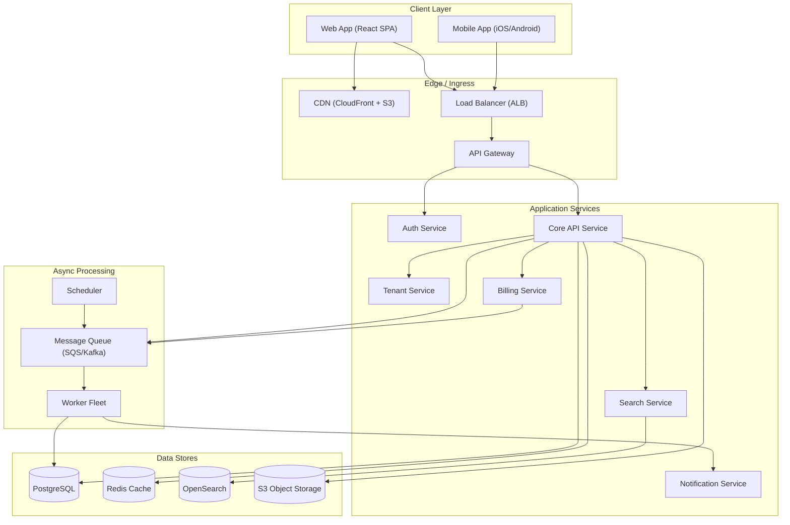
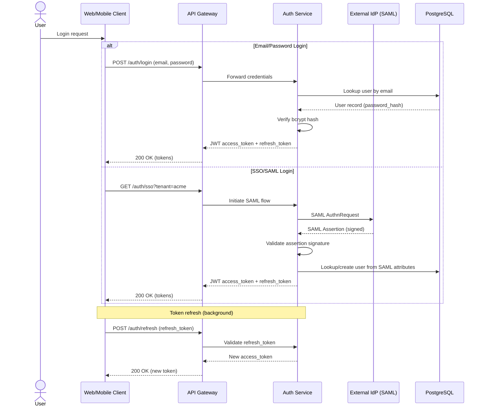
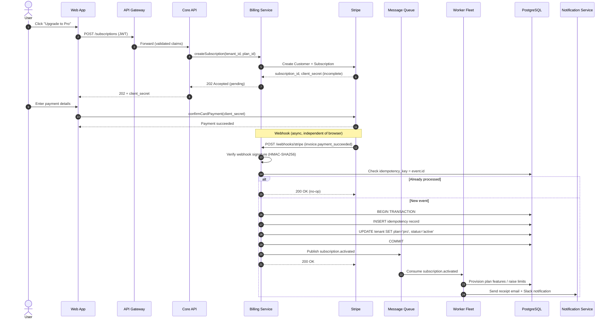
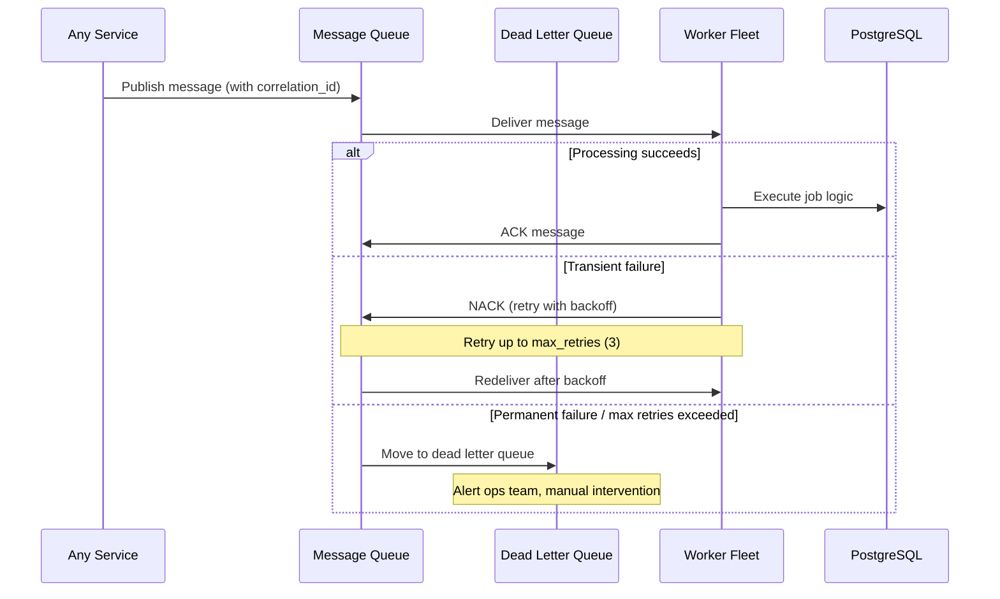

# Design Document: TaskFlow Multi-Tenant SaaS Architecture

## Overview

TaskFlow is a multi-tenant B2B SaaS platform for project management, comparable in scope to Asana or Linear. The system serves multiple organizations (tenants) from a shared infrastructure while enforcing strict data isolation at the row level using a `tenant_id` column on every database table in a shared PostgreSQL cluster.

The architecture separates synchronous request handling (API layer serving REST/GraphQL) from asynchronous background processing (billing webhooks, email delivery, search indexing, scheduled jobs) via a message queue. This separation ensures the user-facing API remains responsive while heavyweight or unreliable operations (third-party calls, fan-out notifications) execute independently with retry semantics.

The most critical system flow is the paid subscription lifecycle, where Stripe webhooks drive plan activation through an idempotent handler that guarantees exactly-once processing regardless of webhook redelivery. The design prioritizes correctness over convenience: billing state changes are never derived from client-side payment confirmation alone.

## Architecture

### System Topology

The system is organized into five logical layers: Client, Edge/Ingress, Application Services, Async Processing, and Data Stores, with cross-cutting observability and third-party integrations.



### Request Flow Layers

| Layer | Components | Protocol | Scaling Model |
|-------|-----------|----------|---------------|
| Client | Web SPA, Mobile Apps | HTTPS | N/A (client-side) |
| Edge | CDN, ALB, API Gateway | HTTPS, TLS termination | Managed services, auto-scale |
| Application | Auth, Core API, Tenant, Billing, Search, Notification | REST/GraphQL (sync) | Horizontal, stateless |
| Async | Queue, Workers, Scheduler | Message-based | Horizontal consumers |
| Data | PostgreSQL, Redis, OpenSearch, S3 | Native protocols | Vertical + read replicas |

## Sequence Diagrams

### Authentication Flow



### Paid Subscription Activation Flow (Critical Path)



### Async Job Processing Flow



## Components and Interfaces

### Component 1: API Gateway

**Purpose**: Single entry point for all API traffic. Handles TLS termination, rate limiting, request routing, and JWT validation delegation.

**Interface**:
```pascal
INTERFACE APIGateway
  PROCEDURE routeRequest(request: HTTPRequest): HTTPResponse
  PROCEDURE validateRateLimit(client_ip: String, tenant_id: UUID): Boolean
  PROCEDURE terminateTLS(raw_connection: TLSConnection): PlaintextStream
END INTERFACE
```

**Responsibilities**:
- Route incoming requests to appropriate backend service
- Enforce per-tenant and per-IP rate limits
- Delegate JWT validation to Auth Service
- Return 429 Too Many Requests when rate limit exceeded
- Strip/sanitize headers before forwarding to backends

### Component 2: Auth Service

**Purpose**: Manages user identity, issues and validates JWTs, handles OAuth2/OIDC flows, and delegates enterprise SSO via SAML to external IdPs.

**Interface**:
```pascal
INTERFACE AuthService
  PROCEDURE login(email: String, password: String): AuthResult
  PROCEDURE initiateSSO(tenant_id: UUID): SAMLRedirectURL
  PROCEDURE handleSAMLCallback(assertion: SAMLAssertion): AuthResult
  PROCEDURE validateToken(token: JWT): TokenClaims
  PROCEDURE refreshToken(refresh_token: String): AuthResult
  PROCEDURE revokeToken(token: JWT): Void
END INTERFACE

STRUCTURE AuthResult
  access_token: JWT
  refresh_token: String
  expires_in: Integer
  token_type: String  // always "Bearer"
END STRUCTURE

STRUCTURE TokenClaims
  user_id: UUID
  tenant_id: UUID
  roles: List[String]
  permissions: List[String]
  issued_at: Timestamp
  expires_at: Timestamp
END STRUCTURE
```

**Responsibilities**:
- Issue short-lived access tokens (15 min TTL) and long-lived refresh tokens (7 day TTL)
- Validate JWT signature and expiration on every request
- Enforce tenant-scoped claims (user cannot access resources outside their tenant)
- Handle SAML assertion parsing and user provisioning for SSO tenants
- Maintain token revocation list in Redis for immediate invalidation

### Component 3: Core API Service

**Purpose**: Primary business logic layer handling projects, tasks, teams, and comments. Stateless, horizontally scaled.

**Interface**:
```pascal
INTERFACE CoreAPIService
  // Projects
  PROCEDURE createProject(tenant_id: UUID, data: ProjectInput): Project
  PROCEDURE getProject(tenant_id: UUID, project_id: UUID): Project
  PROCEDURE listProjects(tenant_id: UUID, filters: ProjectFilters): PaginatedList[Project]

  // Tasks
  PROCEDURE createTask(tenant_id: UUID, project_id: UUID, data: TaskInput): Task
  PROCEDURE updateTask(tenant_id: UUID, task_id: UUID, data: TaskUpdate): Task
  PROCEDURE assignTask(tenant_id: UUID, task_id: UUID, assignee_id: UUID): Task

  // Subscriptions
  PROCEDURE initiateSubscription(tenant_id: UUID, plan_id: String): SubscriptionIntent
  PROCEDURE getSubscriptionStatus(tenant_id: UUID): SubscriptionStatus
END INTERFACE
```

**Responsibilities**:
- Enforce tenant_id scoping on every database query
- Validate authorization (role-based) before mutations
- Publish domain events to message queue for async processing
- Apply plan-based feature limits via Tenant Service

### Component 4: Tenant Service

**Purpose**: Manages tenant lifecycle (provisioning, plan limits, seat counts) and enforces multi-tenancy boundaries.

**Interface**:
```pascal
INTERFACE TenantService
  PROCEDURE provisionTenant(org_name: String, admin_email: String): Tenant
  PROCEDURE getTenant(tenant_id: UUID): Tenant
  PROCEDURE updatePlanLimits(tenant_id: UUID, plan: PlanType): Void
  PROCEDURE checkFeatureAccess(tenant_id: UUID, feature: String): Boolean
  PROCEDURE getSeatCount(tenant_id: UUID): SeatInfo
  PROCEDURE enforceSeatLimit(tenant_id: UUID): Boolean
END INTERFACE

STRUCTURE Tenant
  id: UUID
  name: String
  slug: String
  plan: PlanType  // free, pro, enterprise
  status: TenantStatus  // active, suspended, cancelled
  seat_limit: Integer
  created_at: Timestamp
END STRUCTURE

ENUMERATION PlanType
  FREE
  PRO
  ENTERPRISE
END ENUMERATION
```

**Responsibilities**:
- Maintain source of truth for tenant plan and feature entitlements
- Enforce seat limits (reject invitations when limit reached)
- Provide feature-flag checks scoped to plan tier
- Handle tenant suspension on payment failure

### Component 5: Billing Service

**Purpose**: Owns all Stripe interaction, manages subscription lifecycle, processes webhooks, and maintains billing state as single source of truth.

**Interface**:
```pascal
INTERFACE BillingService
  PROCEDURE createSubscription(tenant_id: UUID, plan_id: String): SubscriptionIntent
  PROCEDURE cancelSubscription(tenant_id: UUID): CancellationResult
  PROCEDURE handleWebhook(payload: RawBody, signature: String): WebhookResult
  PROCEDURE getInvoiceHistory(tenant_id: UUID): List[Invoice]
  PROCEDURE retryFailedPayment(tenant_id: UUID): PaymentRetryResult
END INTERFACE

STRUCTURE SubscriptionIntent
  subscription_id: String
  client_secret: String
  status: String  // "incomplete", "active", "cancelled"
END STRUCTURE

STRUCTURE WebhookResult
  processed: Boolean
  idempotent_hit: Boolean
  event_type: String
END STRUCTURE
```

**Responsibilities**:
- Create and manage Stripe customers and subscriptions
- Verify webhook signatures using HMAC-SHA256
- Enforce idempotency on webhook processing (keyed on event.id)
- Publish billing domain events to message queue
- Handle payment failure gracefully (dunning flow)

### Component 6: Notification Service

**Purpose**: Fan-out of user-facing notifications to email (SendGrid) and chat (Slack) channels.

**Interface**:
```pascal
INTERFACE NotificationService
  PROCEDURE sendEmail(recipient: EmailAddress, template: String, data: Map): DeliveryResult
  PROCEDURE sendSlackMessage(channel: String, message: SlackBlock): DeliveryResult
  PROCEDURE sendBulkNotification(tenant_id: UUID, event: DomainEvent): Void
END INTERFACE
```

### Component 7: Search Service

**Purpose**: Full-text search over tasks and projects, backed by OpenSearch. Updated asynchronously via queue-driven indexing.

**Interface**:
```pascal
INTERFACE SearchService
  PROCEDURE search(tenant_id: UUID, query: String, filters: SearchFilters): SearchResults
  PROCEDURE indexDocument(tenant_id: UUID, doc_type: String, document: Map): Void
  PROCEDURE removeDocument(tenant_id: UUID, doc_type: String, doc_id: UUID): Void
  PROCEDURE reindexTenant(tenant_id: UUID): JobHandle
END INTERFACE
```

### Component 8: Worker Fleet

**Purpose**: Executes async jobs consumed from the message queue. Handles indexing, provisioning, email triggers, and scheduled tasks.

**Interface**:
```pascal
INTERFACE Worker
  PROCEDURE processMessage(message: QueueMessage): ProcessingResult
  PROCEDURE handleSubscriptionActivated(event: SubscriptionEvent): Void
  PROCEDURE handleSearchIndexUpdate(event: IndexEvent): Void
  PROCEDURE handleScheduledReminder(event: ReminderEvent): Void
END INTERFACE

STRUCTURE QueueMessage
  id: UUID
  event_type: String
  payload: Map
  correlation_id: UUID
  published_at: Timestamp
  retry_count: Integer
  max_retries: Integer
END STRUCTURE

ENUMERATION ProcessingResult
  SUCCESS
  RETRY
  DEAD_LETTER
END ENUMERATION
```

## Data Models

### Multi-Tenancy Core Schema

```pascal
STRUCTURE TenantRecord
  id: UUID PRIMARY KEY
  name: String NOT NULL
  slug: String UNIQUE NOT NULL
  plan: PlanType DEFAULT FREE
  status: TenantStatus DEFAULT ACTIVE
  stripe_customer_id: String NULLABLE
  seat_limit: Integer DEFAULT 5
  created_at: Timestamp DEFAULT NOW()
  updated_at: Timestamp DEFAULT NOW()
END STRUCTURE

STRUCTURE UserRecord
  id: UUID PRIMARY KEY
  tenant_id: UUID FOREIGN KEY -> TenantRecord.id NOT NULL
  email: String UNIQUE NOT NULL
  password_hash: String NULLABLE  // NULL for SSO-only users
  name: String NOT NULL
  role: UserRole DEFAULT MEMBER
  sso_provider: String NULLABLE
  sso_subject_id: String NULLABLE
  created_at: Timestamp DEFAULT NOW()
  
  INDEX (tenant_id)
  INDEX (email)
  UNIQUE (tenant_id, email)
END STRUCTURE

STRUCTURE ProjectRecord
  id: UUID PRIMARY KEY
  tenant_id: UUID FOREIGN KEY -> TenantRecord.id NOT NULL
  name: String NOT NULL
  description: Text NULLABLE
  status: ProjectStatus DEFAULT ACTIVE
  owner_id: UUID FOREIGN KEY -> UserRecord.id
  created_at: Timestamp DEFAULT NOW()
  updated_at: Timestamp DEFAULT NOW()

  INDEX (tenant_id)
  INDEX (tenant_id, status)
END STRUCTURE

STRUCTURE TaskRecord
  id: UUID PRIMARY KEY
  tenant_id: UUID FOREIGN KEY -> TenantRecord.id NOT NULL
  project_id: UUID FOREIGN KEY -> ProjectRecord.id NOT NULL
  title: String NOT NULL
  description: Text NULLABLE
  status: TaskStatus DEFAULT TODO
  priority: Priority DEFAULT MEDIUM
  assignee_id: UUID FOREIGN KEY -> UserRecord.id NULLABLE
  due_date: Date NULLABLE
  created_at: Timestamp DEFAULT NOW()
  updated_at: Timestamp DEFAULT NOW()

  INDEX (tenant_id)
  INDEX (tenant_id, project_id)
  INDEX (tenant_id, assignee_id)
  INDEX (tenant_id, status)
END STRUCTURE
```

**Validation Rules**:
- Every table includes `tenant_id` as a non-nullable indexed column
- All queries MUST include `tenant_id` in WHERE clause (enforced at ORM/query-builder level)
- Foreign key references within a tenant must share the same `tenant_id`
- `slug` must be URL-safe, lowercase, alphanumeric with hyphens only

### Billing & Subscription Schema

```pascal
STRUCTURE SubscriptionRecord
  id: UUID PRIMARY KEY
  tenant_id: UUID FOREIGN KEY -> TenantRecord.id NOT NULL
  stripe_subscription_id: String UNIQUE NOT NULL
  stripe_customer_id: String NOT NULL
  plan_id: String NOT NULL
  status: SubscriptionStatus NOT NULL  // incomplete, active, past_due, cancelled
  current_period_start: Timestamp NOT NULL
  current_period_end: Timestamp NOT NULL
  cancel_at_period_end: Boolean DEFAULT FALSE
  created_at: Timestamp DEFAULT NOW()
  updated_at: Timestamp DEFAULT NOW()

  INDEX (tenant_id)
  INDEX (stripe_subscription_id)
END STRUCTURE

STRUCTURE IdempotencyRecord
  id: UUID PRIMARY KEY
  idempotency_key: String UNIQUE NOT NULL  // Stripe event.id
  event_type: String NOT NULL
  processed_at: Timestamp DEFAULT NOW()
  response_status: Integer NOT NULL
  
  INDEX (idempotency_key)
  // TTL: records older than 30 days can be purged
END STRUCTURE

STRUCTURE InvoiceRecord
  id: UUID PRIMARY KEY
  tenant_id: UUID FOREIGN KEY -> TenantRecord.id NOT NULL
  stripe_invoice_id: String UNIQUE NOT NULL
  amount_cents: Integer NOT NULL
  currency: String DEFAULT "usd"
  status: InvoiceStatus NOT NULL  // draft, open, paid, void
  paid_at: Timestamp NULLABLE
  created_at: Timestamp DEFAULT NOW()

  INDEX (tenant_id)
END STRUCTURE
```

**Validation Rules**:
- `idempotency_key` uniqueness prevents double-processing of webhook events
- `stripe_subscription_id` is never generated locally — always sourced from Stripe API responses
- `amount_cents` stored as integer to avoid floating-point currency issues
- Subscription status transitions follow a defined state machine (see Algorithmic Pseudocode section)

## Algorithmic Pseudocode

### Webhook Processing Algorithm (Critical Path)

```pascal
ALGORITHM handleStripeWebhook(payload, signature_header)
INPUT: payload (raw HTTP body as bytes), signature_header (Stripe-Signature header)
OUTPUT: WebhookResult

BEGIN
  // Step 1: Verify webhook authenticity
  computed_signature ← HMAC_SHA256(webhook_secret, payload)
  
  IF NOT constantTimeCompare(computed_signature, signature_header.signature) THEN
    LOG_WARNING("Invalid webhook signature", source_ip)
    RETURN WebhookResult(processed: FALSE, error: "Invalid signature")
  END IF

  event ← parseJSON(payload)

  // Step 2: Idempotency check
  existing ← database.query("SELECT * FROM idempotency WHERE idempotency_key = ?", event.id)
  
  IF existing IS NOT NULL THEN
    LOG_INFO("Duplicate webhook, skipping", event.id)
    RETURN WebhookResult(processed: TRUE, idempotent_hit: TRUE, event_type: event.type)
  END IF

  // Step 3: Process event within transaction
  transaction ← database.beginTransaction()
  
  TRY
    // Insert idempotency record first (acts as distributed lock)
    transaction.execute(
      "INSERT INTO idempotency (idempotency_key, event_type, response_status) VALUES (?, ?, ?)",
      event.id, event.type, 200
    )

    // Dispatch to event-specific handler
    CASE event.type OF
      "invoice.payment_succeeded":
        processPaymentSucceeded(transaction, event.data)
      "customer.subscription.deleted":
        processSubscriptionCancelled(transaction, event.data)
      "invoice.payment_failed":
        processPaymentFailed(transaction, event.data)
      DEFAULT:
        LOG_INFO("Unhandled event type", event.type)
    END CASE

    transaction.commit()
    
  CATCH DatabaseError AS e
    transaction.rollback()
    LOG_ERROR("Webhook processing failed", event.id, e.message)
    RETURN WebhookResult(processed: FALSE, error: e.message)
    // Stripe will retry with exponential backoff
  END TRY

  // Step 4: Publish domain event to queue (outside transaction)
  TRY
    queue.publish(
      event_type: "subscription.activated",
      payload: { tenant_id: event.data.tenant_id, plan: event.data.plan },
      correlation_id: event.id
    )
  CATCH QueuePublishError AS e
    // Critical: DB committed but queue publish failed
    // Write to local outbox table for retry
    database.execute(
      "INSERT INTO outbox (event_type, payload, status) VALUES (?, ?, 'pending')",
      "subscription.activated", serialize(event.data)
    )
    LOG_ERROR("Queue publish failed, written to outbox", event.id)
  END TRY

  RETURN WebhookResult(processed: TRUE, idempotent_hit: FALSE, event_type: event.type)
END
```

**Preconditions:**
- `webhook_secret` is configured and non-empty
- Database connection pool is available
- Message queue connection is established (with fallback to outbox pattern)

**Postconditions:**
- Event is processed exactly once regardless of redelivery
- If processing fails, no partial state changes persist (transaction rolled back)
- If queue publish fails after DB commit, event is captured in outbox for retry
- Stripe receives 200 OK only when processing fully succeeds

**Loop Invariants:** N/A (no loops in this algorithm)

### Payment Succeeded Handler

```pascal
ALGORITHM processPaymentSucceeded(transaction, event_data)
INPUT: transaction (active DB transaction), event_data (Stripe event payload)
OUTPUT: Void (side effects: DB updates)

BEGIN
  subscription ← transaction.query(
    "SELECT * FROM subscriptions WHERE stripe_subscription_id = ?",
    event_data.subscription_id
  )
  
  IF subscription IS NULL THEN
    RAISE Error("Subscription not found for stripe_subscription_id: " + event_data.subscription_id)
  END IF

  tenant_id ← subscription.tenant_id
  new_plan ← mapStripePlanToInternal(event_data.plan_id)

  // Update subscription status
  transaction.execute(
    "UPDATE subscriptions SET status = 'active', plan_id = ?, updated_at = NOW() WHERE id = ?",
    new_plan, subscription.id
  )

  // Update tenant plan
  transaction.execute(
    "UPDATE tenants SET plan = ?, status = 'active', updated_at = NOW() WHERE id = ?",
    new_plan, tenant_id
  )

  // Record invoice
  transaction.execute(
    "INSERT INTO invoices (tenant_id, stripe_invoice_id, amount_cents, currency, status, paid_at) VALUES (?, ?, ?, ?, 'paid', NOW())",
    tenant_id, event_data.invoice_id, event_data.amount_paid, event_data.currency
  )
END
```

**Preconditions:**
- `transaction` is an active, uncommitted database transaction
- `event_data` contains valid `subscription_id`, `plan_id`, `invoice_id`, `amount_paid`, `currency`
- Subscription record exists for the given `stripe_subscription_id`

**Postconditions:**
- Subscription status is "active" with correct plan_id
- Tenant plan is updated to match the new subscription
- Invoice record is created with "paid" status
- All changes are within the same transaction (atomicity guaranteed by caller)

### Tenant-Scoped Query Enforcement

```pascal
ALGORITHM executeTenantQuery(tenant_id, base_query, params)
INPUT: tenant_id (UUID from JWT claims), base_query (SQL string), params (query parameters)
OUTPUT: QueryResult

BEGIN
  // Validate tenant_id is present (defense in depth)
  IF tenant_id IS NULL OR tenant_id = "" THEN
    RAISE SecurityError("tenant_id is required for all data access")
  END IF

  // Inject tenant_id into query
  scoped_query ← base_query + " AND tenant_id = ?"
  scoped_params ← params + [tenant_id]

  // Execute with row-level security
  result ← database.execute(scoped_query, scoped_params)

  // Verify no cross-tenant data leaked (assertion, not business logic)
  FOR each row IN result DO
    ASSERT row.tenant_id = tenant_id
  END FOR

  RETURN result
END
```

**Preconditions:**
- `tenant_id` is extracted from validated JWT claims (not user input)
- `base_query` is a parameterized query (no raw string interpolation)

**Postconditions:**
- Every row in result belongs to the specified tenant
- No cross-tenant data exposure is possible
- If tenant_id is missing, request is rejected before any DB call

**Loop Invariants:**
- For verification loop: all previously checked rows have matching `tenant_id`

### JWT Validation Algorithm

```pascal
ALGORITHM validateJWT(token)
INPUT: token (JWT string from Authorization header)
OUTPUT: TokenClaims or AuthError

BEGIN
  // Step 1: Parse token structure
  parts ← split(token, ".")
  IF length(parts) ≠ 3 THEN
    RETURN AuthError("Malformed token")
  END IF

  header ← base64Decode(parts[0])
  payload ← base64Decode(parts[1])
  signature ← parts[2]

  // Step 2: Verify algorithm matches expected
  IF header.alg ≠ "RS256" THEN
    RETURN AuthError("Unsupported algorithm")
  END IF

  // Step 3: Verify signature
  expected_sig ← RSA_SHA256_Sign(header_raw + "." + payload_raw, private_key)
  IF NOT constantTimeCompare(signature, expected_sig) THEN
    RETURN AuthError("Invalid signature")
  END IF

  // Step 4: Check expiration
  IF payload.exp < currentTimestamp() THEN
    RETURN AuthError("Token expired")
  END IF

  // Step 5: Check revocation list
  IF redis.exists("revoked:" + payload.jti) THEN
    RETURN AuthError("Token revoked")
  END IF

  // Step 6: Construct claims
  claims ← TokenClaims(
    user_id: payload.sub,
    tenant_id: payload.tenant_id,
    roles: payload.roles,
    permissions: payload.permissions,
    issued_at: payload.iat,
    expires_at: payload.exp
  )

  RETURN claims
END
```

**Preconditions:**
- `token` is a non-empty string from the Authorization Bearer header
- RSA public key is loaded and available for verification
- Redis connection is available for revocation check

**Postconditions:**
- Returns valid TokenClaims if and only if token is correctly signed, not expired, and not revoked
- Returns AuthError with descriptive message for any validation failure
- No side effects (pure validation)

### Subscription State Machine

```pascal
ALGORITHM transitionSubscriptionState(current_state, event)
INPUT: current_state (SubscriptionStatus), event (String)
OUTPUT: new_state (SubscriptionStatus) or InvalidTransitionError

BEGIN
  // Define valid state transitions
  valid_transitions ← {
    ("incomplete", "payment_succeeded") → "active",
    ("incomplete", "payment_failed") → "incomplete_expired",
    ("active", "payment_failed") → "past_due",
    ("active", "cancellation_requested") → "active",  // cancel_at_period_end = true
    ("active", "period_ended_with_cancel") → "cancelled",
    ("past_due", "payment_succeeded") → "active",
    ("past_due", "max_retries_exceeded") → "cancelled",
    ("cancelled", "resubscribe") → "incomplete"
  }

  key ← (current_state, event)
  
  IF key IN valid_transitions THEN
    new_state ← valid_transitions[key]
    LOG_INFO("Subscription transition", current_state, "→", new_state, "via", event)
    RETURN new_state
  ELSE
    LOG_WARNING("Invalid state transition attempted", current_state, event)
    RAISE InvalidTransitionError(current_state, event)
  END IF
END
```

**Preconditions:**
- `current_state` is a valid SubscriptionStatus enum value
- `event` is a recognized billing event string

**Postconditions:**
- Returns a valid next state if transition is allowed
- Raises error for invalid transitions (no silent state corruption)
- State machine is deterministic: same (state, event) always yields same result

### Dead Letter Queue Processor (Outbox Pattern)

```pascal
ALGORITHM processOutbox()
INPUT: None (reads from outbox table)
OUTPUT: Integer (count of successfully processed records)

BEGIN
  processed_count ← 0
  
  // Fetch pending outbox records (oldest first, limited batch)
  pending ← database.query(
    "SELECT * FROM outbox WHERE status = 'pending' AND retry_count < ? ORDER BY created_at ASC LIMIT ?",
    MAX_RETRIES, BATCH_SIZE
  )

  FOR each record IN pending DO
    // Loop invariant: all previously processed records have been either
    // successfully published or marked for retry/dead-letter
    
    TRY
      queue.publish(
        event_type: record.event_type,
        payload: record.payload,
        correlation_id: record.id
      )
      
      database.execute(
        "UPDATE outbox SET status = 'published', published_at = NOW() WHERE id = ?",
        record.id
      )
      processed_count ← processed_count + 1
      
    CATCH QueuePublishError AS e
      new_retry_count ← record.retry_count + 1
      
      IF new_retry_count >= MAX_RETRIES THEN
        database.execute(
          "UPDATE outbox SET status = 'dead_letter', updated_at = NOW() WHERE id = ?",
          record.id
        )
        alertOpsTeam("Outbox record moved to dead letter", record.id)
      ELSE
        next_retry_at ← NOW() + exponentialBackoff(new_retry_count)
        database.execute(
          "UPDATE outbox SET retry_count = ?, next_retry_at = ?, updated_at = NOW() WHERE id = ?",
          new_retry_count, next_retry_at, record.id
        )
      END IF
    END TRY
  END FOR

  RETURN processed_count
END
```

**Preconditions:**
- Database connection is available
- Queue connection may or may not be available (that's why we're retrying)
- MAX_RETRIES and BATCH_SIZE are configured positive integers

**Postconditions:**
- All processable outbox records are attempted
- Successfully published records are marked as 'published'
- Failed records are retried with exponential backoff
- Records exceeding MAX_RETRIES are moved to dead letter and ops is alerted

**Loop Invariants:**
- All previously iterated records have been handled (published, retried, or dead-lettered)
- `processed_count` equals the number of successfully published records so far

## Key Functions with Formal Specifications

### Function: createSubscription()

```pascal
PROCEDURE createSubscription(tenant_id: UUID, plan_id: String): SubscriptionIntent
```

**Preconditions:**
- `tenant_id` refers to an existing, active tenant
- `plan_id` is one of: "pro", "enterprise"
- Tenant does not already have an active subscription for this plan
- Tenant has a valid Stripe customer ID (or one will be created)

**Postconditions:**
- A Stripe subscription is created with status "incomplete"
- A local SubscriptionRecord is created with matching stripe_subscription_id
- Returns `client_secret` for client-side payment confirmation
- If Stripe API call fails, no local records are created (atomic)

### Function: handleWebhook()

```pascal
PROCEDURE handleWebhook(payload: RawBody, signature: String): WebhookResult
```

**Preconditions:**
- `payload` is the raw, unmodified HTTP request body
- `signature` is the value of the Stripe-Signature header
- Webhook secret is configured in environment

**Postconditions:**
- If signature is invalid: returns error, no state changes
- If event already processed (idempotent): returns success with `idempotent_hit: TRUE`
- If new valid event: processes atomically, publishes domain event, returns success
- Stripe receives 200 OK only on success (triggers retry on non-200)

### Function: validateToken()

```pascal
PROCEDURE validateToken(token: JWT): TokenClaims
```

**Preconditions:**
- `token` is a non-empty string
- RSA public key is available for signature verification
- Redis is available for revocation check (degrades gracefully if unavailable)

**Postconditions:**
- Returns TokenClaims with `tenant_id`, `user_id`, `roles`, `permissions`
- Raises AuthError if token is malformed, expired, revoked, or has invalid signature
- Pure function: no side effects on any data store

### Function: executeTenantQuery()

```pascal
PROCEDURE executeTenantQuery(tenant_id: UUID, base_query: String, params: List): QueryResult
```

**Preconditions:**
- `tenant_id` is non-null (extracted from validated JWT, never from user input)
- `base_query` uses parameterized placeholders (no string interpolation)
- Database connection pool has available connections

**Postconditions:**
- Every row in result has `tenant_id` matching the input
- Cross-tenant data access is impossible (defense in depth)
- Raises SecurityError if `tenant_id` is null/empty (fail-closed)

## Example Usage

### Creating a Subscription (Client → Server → Stripe)

```pascal
// Client-side: User clicks "Upgrade to Pro"
SEQUENCE
  response ← HTTP_POST("/subscriptions", {
    plan_id: "pro"
  }, headers: { Authorization: "Bearer " + access_token })

  IF response.status = 202 THEN
    // Show Stripe payment form with client_secret
    stripe_elements.confirmPayment(response.body.client_secret)
  ELSE IF response.status = 401 THEN
    // Token expired, refresh and retry
    new_token ← HTTP_POST("/auth/refresh", { refresh_token: stored_refresh_token })
    // Retry with new token
  END IF
END SEQUENCE
```

### Server-side Webhook Handling

```pascal
// Billing Service: Stripe calls POST /webhooks/stripe
SEQUENCE
  raw_body ← request.rawBody
  signature ← request.headers["Stripe-Signature"]
  
  result ← handleStripeWebhook(raw_body, signature)
  
  IF result.processed = TRUE THEN
    RESPOND 200 OK
  ELSE
    RESPOND 400 Bad Request
    // Stripe will retry this webhook
  END IF
END SEQUENCE
```

### Multi-Tenant Task Query

```pascal
// Core API: GET /projects/:project_id/tasks
SEQUENCE
  claims ← validateToken(request.headers.authorization)
  tenant_id ← claims.tenant_id
  project_id ← request.params.project_id

  // Verify project belongs to tenant
  project ← executeTenantQuery(
    tenant_id,
    "SELECT * FROM projects WHERE id = ?",
    [project_id]
  )

  IF project IS NULL THEN
    RESPOND 404 Not Found
  END IF

  // Fetch tasks with tenant scoping
  tasks ← executeTenantQuery(
    tenant_id,
    "SELECT * FROM tasks WHERE project_id = ? ORDER BY created_at DESC LIMIT ? OFFSET ?",
    [project_id, page_size, offset]
  )

  RESPOND 200 OK { data: tasks, pagination: { total, page, page_size } }
END SEQUENCE
```

## Correctness Properties

*A property is a characteristic or behavior that should hold true across all valid executions of a system — essentially, a formal statement about what the system should do. Properties serve as the bridge between human-readable specifications and machine-verifiable correctness guarantees.*

### Property 1: Tenant Data Isolation

*For any* database query executed by an authenticated user, every row in the result set SHALL have a `tenant_id` equal to the authenticated user's `tenant_id`, and any request with a null/empty `tenant_id` SHALL be rejected with a SecurityError before any data access occurs.

**Validates: Requirements 1.2, 1.3, 1.4, 1.5, 10.3**

### Property 2: Webhook Idempotency

*For any* valid Stripe webhook event processed N times (where N ≥ 1), the final database state after N processings SHALL be identical to the database state after exactly 1 processing.

**Validates: Requirements 5.3, 5.4, 5.7**

### Property 3: Transaction Atomicity (No Partial State on Failure)

*For any* webhook processing where the database transaction fails, the database state after the failed processing SHALL be identical to the database state before the processing began (complete rollback, no partial writes persist).

**Validates: Requirements 5.5, 5.6, 4.6, 16.1**

### Property 4: Subscription State Machine Determinism and Integrity

*For any* (current_state, event) pair, the subscription state machine SHALL always produce the same next_state, and SHALL only permit transitions defined in the valid_transitions set. For any pair NOT in the valid_transitions set, the system SHALL raise an InvalidTransitionError.

**Validates: Requirements 8.1, 8.2, 8.3, 4.4, 4.5**

### Property 5: Message Delivery Guarantee (No Silent Loss)

*For any* message published to the queue, the message SHALL eventually reach a terminal state of either "successfully processed" or "moved to Dead_Letter_Queue". No message SHALL be silently lost, and retry_count SHALL never exceed MAX_RETRIES.

**Validates: Requirements 7.1, 7.2, 7.3, 16.4**

### Property 6: Webhook Signature Verification

*For any* incoming webhook payload, the Billing_Service SHALL verify the HMAC-SHA256 signature using constant-time comparison, and SHALL reject any payload with an invalid or missing signature with a 400 response before performing any state changes.

**Validates: Requirements 5.1, 5.2**

### Property 7: Outbox Eventual Delivery with Exponential Backoff

*For any* event written to the outbox table with status "pending", the outbox processor SHALL eventually either publish it to the queue (status "published") or move it to dead_letter status after exceeding MAX_RETRIES, using exponential backoff between retry attempts.

**Validates: Requirements 6.1, 6.3, 6.4, 6.5**

### Property 8: Rate Limit Tenant Isolation

*For any* two distinct tenants T1 and T2, when T1 exceeds their rate limit, the response times for T2's requests SHALL remain unaffected. Rate limits SHALL be graduated by plan tier (free < pro < enterprise).

**Validates: Requirements 12.1, 12.3, 12.4, 12.5**

### Property 9: JWT Validation Determinism

*For any* JWT input, the validateToken function SHALL always return the same result (valid claims or specific AuthError) — the function is pure with no randomness in validation logic. Valid tokens produce claims; invalid/expired/revoked tokens produce AuthError.

**Validates: Requirements 2.4, 2.5, 2.7**

### Property 10: Seat Limit Enforcement

*For any* tenant whose current seat count equals their seat_limit, attempting to invite an additional user SHALL be rejected. For any tenant below their seat_limit, invitations SHALL be accepted.

**Validates: Requirements 9.3**

### Property 11: Cache Invalidation on Mutation

*For any* write mutation to a project, task, or tenant plan, the corresponding cache entries in Redis SHALL be invalidated, ensuring subsequent reads reflect the updated state.

**Validates: Requirements 15.2, 15.3**

### Property 12: Notification Fan-Out Completeness

*For any* triggered notification event with multiple configured channels, the Notification_Service SHALL attempt delivery to all configured channels. Failure of one non-critical channel (Slack) SHALL not prevent delivery to other channels.

**Validates: Requirements 11.2, 11.4**

## Error Handling

### Error Scenario 1: Stripe Webhook Signature Failure

**Condition**: Incoming webhook has invalid or missing HMAC signature
**Response**: Return 400 Bad Request immediately; log warning with source IP
**Recovery**: No recovery needed — Stripe will not redeliver if we responded (this indicates a forged request). If legitimate, Stripe's own retry mechanism handles missed deliveries.

### Error Scenario 2: Duplicate Webhook (Idempotency Hit)

**Condition**: Webhook event.id already exists in idempotency table
**Response**: Return 200 OK immediately (no-op); log at INFO level
**Recovery**: None needed — system is already in correct state from first processing

### Error Scenario 3: Database Transaction Failure During Webhook

**Condition**: Database write fails (connection error, constraint violation, deadlock)
**Response**: Roll back transaction; return 500 to Stripe (triggers retry)
**Recovery**: Stripe retries with exponential backoff (1hr, 2hr, 4hr, up to 72 hours). System must be designed to succeed on retry after transient DB issues resolve.

### Error Scenario 4: Queue Publish Failure After DB Commit

**Condition**: Database transaction committed but message queue publish fails
**Response**: Write event to local outbox table; log error; return 200 to Stripe (DB state is correct)
**Recovery**: Outbox processor runs on scheduler (every 30 seconds), retries queue publish with exponential backoff. After MAX_RETRIES, moves to dead letter queue and alerts ops.

### Error Scenario 5: Token Expiration During Long Operation

**Condition**: JWT expires between initial validation and operation completion
**Response**: Operation completes (token was valid at request start); subsequent requests require fresh token
**Recovery**: Client detects 401 on next request, uses refresh_token to obtain new access_token, retries

### Error Scenario 6: Cross-Tenant Access Attempt

**Condition**: Request somehow contains a tenant_id different from JWT claims
**Response**: Reject with 403 Forbidden; log as security event (potential attack)
**Recovery**: Alert security team if pattern detected; no data exposed due to defense-in-depth at query layer

### Error Scenario 7: Stripe API Unavailability

**Condition**: Stripe API returns 5xx or times out during subscription creation
**Response**: Return 503 Service Unavailable to client with Retry-After header
**Recovery**: Client retries after suggested interval; no partial subscription records created (operation is atomic)

### Error Scenario 8: Worker Processing Failure

**Condition**: Worker fails to process a queue message (e.g., provisioning fails)
**Response**: NACK message back to queue; increment retry count
**Recovery**: Queue redelivers with exponential backoff (1s, 4s, 16s). After 3 failures, message moves to DLQ for manual investigation.

## Testing Strategy

### Unit Testing Approach

- **Idempotency logic**: Verify that duplicate event.ids produce no state change
- **State machine transitions**: Test all valid transitions and verify invalid transitions raise errors
- **JWT validation**: Test expired tokens, invalid signatures, revoked tokens, malformed tokens
- **Tenant scoping**: Verify queries always include tenant_id; verify SecurityError on null tenant_id
- **Webhook signature verification**: Test valid signatures, tampered payloads, missing headers

### Property-Based Testing Approach

**Property Test Library**: fast-check (JavaScript/TypeScript) or Hypothesis (Python)

**Properties to test**:
1. **Idempotency**: For any valid webhook event processed N times (N > 0), the database state after N processings equals the state after 1 processing
2. **State machine completeness**: For any (state, event) pair not in valid_transitions, the system raises InvalidTransitionError
3. **Tenant isolation**: For any generated query and any tenant_id, results never contain rows with a different tenant_id
4. **Token validation determinism**: For any JWT input, validateToken always returns the same result (no randomness in validation logic)
5. **Outbox eventual delivery**: For any message written to outbox, given queue becomes available within MAX_RETRIES attempts, message is eventually published

### Integration Testing Approach

- **Stripe webhook end-to-end**: Use Stripe test mode to trigger real webhook events; verify full flow from webhook receipt through DB update through queue publish through worker execution
- **Multi-tenant isolation**: Create two tenants, create data for each, verify neither can access the other's data through any API endpoint
- **Token lifecycle**: Test full flow: login → access → token expires → refresh → re-access → revoke → access denied
- **Queue failure simulation**: Inject queue failures during webhook processing; verify outbox pattern activates and processes correctly
- **Load testing per tenant**: Verify rate limiting correctly isolates tenant traffic under load

## Performance Considerations

### Caching Strategy

| Data | Cache Location | TTL | Invalidation |
|------|---------------|-----|--------------|
| JWT validation (public key) | In-memory | 1 hour | Key rotation event |
| Tenant plan/limits | Redis | 5 minutes | On plan change event |
| Project/task listings | Redis | 30 seconds | On mutation (write-through) |
| Search results | None (OpenSearch handles) | N/A | Async re-index |
| User session data | Redis | 15 minutes | On logout/revocation |

### Database Optimization

- **Indexes**: Composite indexes on `(tenant_id, ...)` for all frequent query patterns
- **Connection pooling**: Per-service connection pool (PgBouncer) to manage connection limits
- **Read replicas**: Route read-heavy queries (task listings, search) to read replicas
- **Partitioning consideration**: If tenant count exceeds 10K, consider hash-partitioning on `tenant_id`

### Queue Throughput

- **Batch publishing**: Group multiple events into single queue publish where possible
- **Consumer parallelism**: Scale worker fleet horizontally based on queue depth metric
- **Message ordering**: Not required for most events (idempotency handles duplicates); use FIFO only for state-machine transitions within a single subscription

## Security Considerations

### Authentication & Authorization

- **JWT RS256 signing**: Asymmetric keys ensure only Auth Service can issue tokens; any service can verify
- **Short-lived access tokens (15 min)**: Limits blast radius of a compromised token
- **Refresh token rotation**: Each refresh_token use issues a new one and invalidates the old
- **Token revocation via Redis**: Immediate invalidation without waiting for expiry (for logout, password change, suspicious activity)
- **RBAC per tenant**: Roles (admin, member, viewer) enforced at API layer before business logic

### Data Protection

- **Row-level isolation**: `tenant_id` on every row + enforced in query layer = no cross-tenant access
- **Encryption at rest**: PostgreSQL with TDE; S3 with SSE-S3; Redis with at-rest encryption
- **Encryption in transit**: TLS 1.3 between all services; mutual TLS for internal service-to-service
- **Secret management**: Webhook secrets, API keys, DB credentials in AWS Secrets Manager (never in code/config)
- **PII minimization**: Store only necessary user data; support data export and deletion (GDPR right to erasure)

### Webhook Security

- **HMAC-SHA256 signature verification**: Reject any webhook without valid signature
- **Constant-time comparison**: Prevent timing attacks on signature verification
- **IP allowlisting** (optional): Accept webhooks only from Stripe's published IP ranges
- **Replay protection**: Idempotency key (event.id) + timestamp check (reject events older than tolerance window)

### Rate Limiting & Abuse Prevention

- **Per-tenant rate limits**: Prevent noisy neighbor problem
- **Per-IP rate limits**: Protect against credential stuffing on auth endpoints
- **Graduated limits by plan**: Free tier gets lower limits than Pro/Enterprise
- **DDoS protection**: CloudFront + WAF at edge layer

## Dependencies

| Dependency | Purpose | Criticality | Fallback |
|-----------|---------|-------------|----------|
| PostgreSQL | Primary data store | Critical | Read replica for reads; no write fallback |
| Redis | Cache + token revocation | High | Degrade to DB-only (slower, still correct) |
| Stripe | Payment processing | Critical | Queue pending operations; retry when available |
| SendGrid | Transactional email | Medium | Queue emails; users see delay but no data loss |
| OpenSearch | Full-text search | Medium | Degrade to DB LIKE queries (slower) |
| SQS/Kafka | Async messaging | High | Outbox pattern provides local durability |
| S3 | Object storage | Medium | Uploads fail gracefully; retry later |
| CloudFront | CDN / static assets | Low | Serve directly from origin (slower) |
| Slack | Chat notifications | Low | Skip Slack; email-only notification |

## Observability Strategy

### Logging

- **Structured JSON logs** from all services with consistent fields: `timestamp`, `service`, `tenant_id`, `user_id`, `correlation_id`, `level`, `message`
- **Correlation ID propagation**: Generated at API Gateway, passed through all downstream calls (sync and async)
- **PII redaction**: Sensitive fields (email, name) are redacted in logs; only IDs are logged
- **Centralized aggregation**: All logs ship to CloudWatch Logs / Datadog for unified search

### Metrics

| Metric | Source | Alert Threshold |
|--------|--------|-----------------|
| API response time (p99) | API Gateway | > 500ms |
| Webhook processing time | Billing Service | > 5s |
| Queue depth | SQS/Kafka | > 1000 messages for > 5 min |
| Error rate (5xx) | All services | > 1% of requests |
| DB connection pool utilization | PostgreSQL | > 80% |
| Cache hit rate | Redis | < 70% (investigate) |
| Worker failure rate | Worker Fleet | > 5% of messages |
| Dead letter queue size | DLQ | > 0 (immediate alert) |

### Distributed Tracing

- **OpenTelemetry instrumentation** on all services
- **Trace propagation** via W3C Trace Context headers
- **Span creation** at: API Gateway entry, service-to-service calls, DB queries, queue publish/consume, external API calls (Stripe, SendGrid)
- **Sampling**: 100% for errors; 10% for successful requests in production

### Error Tracking

- **Sentry integration** on all services for unhandled exceptions
- **Contextual breadcrumbs**: Include tenant_id, user_id, request path, and recent actions
- **Alert routing**: Critical errors (webhook failures, auth breaches) page on-call; non-critical batch for review
