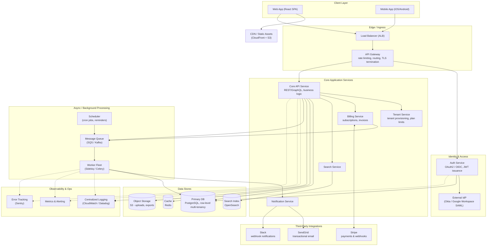
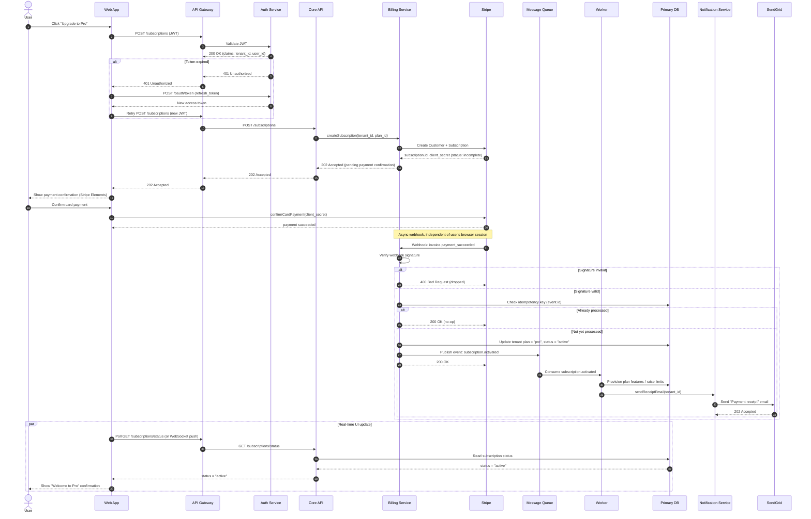

# TaskFlow — Multi-Tenant SaaS Architecture

**Purpose:** Reference architecture and core request flow for a multi-tenant project-management SaaS product ("TaskFlow"), provided as design-first input for spec generation.

## System Overview

TaskFlow is a multi-tenant B2B SaaS application (comparable in scope to Asana/Linear). Tenants sign up, invite team members via SSO or email/password, manage projects and tasks, and upgrade to paid plans billed through Stripe. The system separates synchronous request handling (API layer) from asynchronous work (billing webhooks, email, search indexing) via a message queue, and isolates tenant data at the row level in a shared PostgreSQL cluster.

## Architecture Diagram

## Components

| Component | Responsibility | Notes |
|---|---|---|
| Web App / Mobile App | User-facing clients | React SPA + native mobile clients share the same API |
| CDN | Serves static assets | CloudFront in front of S3 |
| Load Balancer | TLS termination, traffic distribution | Layer 7 ALB |
| API Gateway | Routing, rate limiting, request validation | Single entry point for all API traffic |
| Auth Service | Issues/validates JWTs, manages OAuth2/OIDC flows | Delegates enterprise SSO to external IdP (SAML) |
| Core API Service | Primary business logic (projects, tasks, teams) | REST/GraphQL; stateless, horizontally scaled |
| Tenant Service | Tenant provisioning, plan/seat limits | Enforces multi-tenancy boundaries |
| Billing Service | Subscription lifecycle, invoicing | Owns all Stripe interaction; source of truth for plan state |
| Search Service | Full-text search over tasks/projects | Backed by OpenSearch, updated via async indexing |
| Notification Service | Fan-out of user-facing notifications | Emits to email and Slack channels |
| Message Queue | Decouples sync API from async workers | SQS or Kafka depending on throughput needs |
| Worker Fleet | Executes async jobs (indexing, provisioning, email triggers) | Horizontally scaled consumers |
| Scheduler | Cron-based jobs (reminders, trial expirations) | Publishes to the same queue as other async work |
| Primary DB | System of record | PostgreSQL, tenant_id on every row, indexed |
| Cache | Read-through cache for hot paths | Redis |
| Object Storage | File uploads, exports | S3 |
| Stripe / SendGrid / Slack | Payments, email, chat notifications | Third-party, webhook-driven where applicable |
| Logging / Metrics / Error Tracking | Cross-cutting observability | Every service instruments logs, metrics, and error traces |

## Key Flow: New Paid Subscription

This sequence covers the highest-risk flow in the system: a user upgrading to a paid plan, including token refresh, Stripe checkout, webhook-driven activation, idempotency handling, and async fan-out to provisioning and email.

## Design Considerations for Spec Generation

Multi-tenancy is enforced at the row level (`tenant_id` on every table) rather than schema- or database-per-tenant, trading strict isolation for lower operational overhead at moderate scale. Billing state changes are driven by Stripe webhooks rather than client confirmation, since the client's `confirmCardPayment` success does not guarantee the subscription is actually active — the webhook with signature verification and an idempotency check (keyed on `event.id`) is the single source of truth for plan activation. Any spec derived from this diagram should treat the webhook handler as the critical path and specify retry/backoff behavior for Stripe's webhook redelivery, plus dead-letter handling if the queue publish step fails after the DB write succeeds (a partial-failure case not shown in the happy-path diagram above).

## Assumptions and Open Questions

This diagram assumes a single-region deployment, synchronous REST between the gateway and Core API, and Stripe as the sole payment processor. It does not specify SLAs, exact scaling thresholds, disaster recovery/backup strategy, or a data residency model for tenants with regional compliance requirements — these should be clarified before Kiro (or any downstream spec) treats this as final.
