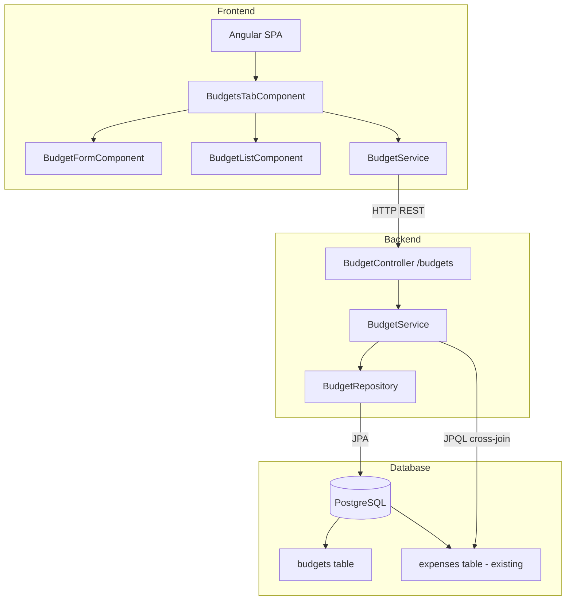
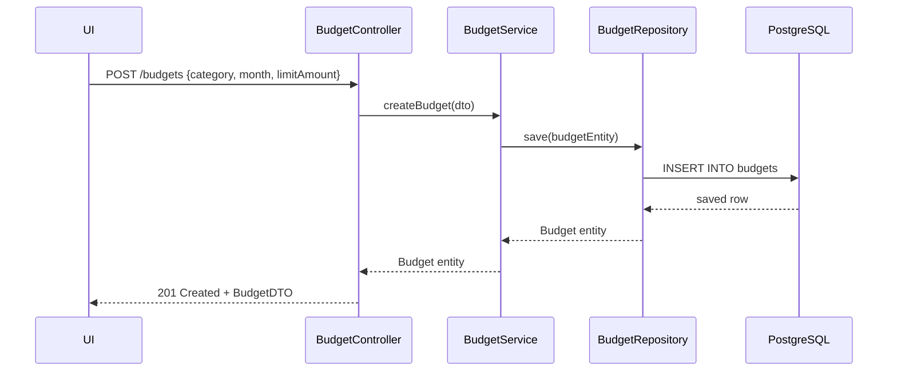
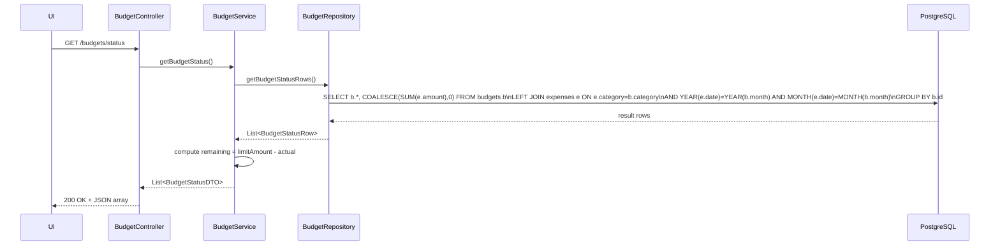

# Design Document: Budgets Module

## Overview

The Budgets Module adds the ability to set monthly spending limits per category and track actual vs. budgeted spend in real time. It extends the existing Budget Tracker application (Spring Boot + PostgreSQL backend, Angular SPA frontend) without modifying any existing expense functionality.

A budget is defined by three fields: **category**, **month** (YYYY-MM string), and **limitAmount**. The `GET /budgets/status` endpoint joins budget limits against actual expense totals (derived from the existing `expenses` table) to produce a live spend-vs-limit report per category/month combination.

The frontend gains a new **Budgets tab** alongside the existing expense view. The tab contains a form to set a budget and a list showing limit, actual spend, remaining amount, and a visual indicator that turns red when a category is over budget.

## Architecture

The new module follows exactly the same three-tier pattern as the existing expenses module:



The `GET /budgets/status` endpoint performs a JPQL aggregate query that JOINs the `budgets` and `expenses` tables on `category` and the year/month of `date`, computing:

- **actual** = SUM of expense amounts for that category in that month (0 if none)
- **remaining** = limitAmount − actual (negative = over budget)

## Sequence Diagrams

### Set a Budget (POST /budgets)



### Get Budget Status (GET /budgets/status)



## Components and Interfaces

### Component 1: BudgetController (REST Layer)

```java
@RestController
@RequestMapping("/budgets")
public class BudgetController {

    @PostMapping
    ResponseEntity<BudgetDTO> createBudget(@Valid @RequestBody BudgetCreateDTO dto);

    @GetMapping
    ResponseEntity<List<BudgetDTO>> getBudgets();

    @PutMapping("/{id}")
    ResponseEntity<BudgetDTO> updateBudget(@PathVariable Long id,
                                           @Valid @RequestBody BudgetCreateDTO dto);

    @DeleteMapping("/{id}")
    ResponseEntity<Void> deleteBudget(@PathVariable Long id);

    @GetMapping("/status")
    ResponseEntity<List<BudgetStatusDTO>> getBudgetStatus();
}
```

**Responsibilities**: request validation, HTTP status codes, delegation to service, DTO mapping.

### Component 2: BudgetService (Business Logic)

```java
@Service
public class BudgetService {

    Budget createBudget(BudgetCreateDTO dto);

    List<Budget> getBudgets();

    Budget updateBudget(Long id, BudgetCreateDTO dto);

    void deleteBudget(Long id);

    List<BudgetStatusDTO> getBudgetStatus();
}
```

**Responsibilities**: validate that `month` is a valid YYYY-MM string, map DTOs to entities, throw `ResourceNotFoundException` for unknown ids, compute the `remaining` field in `getBudgetStatus()`.

### Component 3: BudgetRepository (Data Access)

```java
@Repository
public interface BudgetRepository extends JpaRepository<Budget, Long> {

    @Query("""
        SELECT new com.budgettracker.dto.BudgetStatusRow(
            b.id, b.category, b.month, b.limitAmount,
            COALESCE(SUM(e.amount), 0)
        )
        FROM Budget b
        LEFT JOIN Expense e
          ON e.category = b.category
         AND FUNCTION('YEAR', e.date)  = FUNCTION('YEAR',  CAST(CONCAT(b.month, '-01') AS java.time.LocalDate))
         AND FUNCTION('MONTH', e.date) = FUNCTION('MONTH', CAST(CONCAT(b.month, '-01') AS java.time.LocalDate))
        GROUP BY b.id, b.category, b.month, b.limitAmount
        """)
    List<BudgetStatusRow> getBudgetStatusRows();
}
```

> **Implementation note**: Because PostgreSQL natively supports `DATE_TRUNC` and `TO_DATE`, the actual JPQL may use native queries or `@Query(nativeQuery=true)`. The implementation task should use a `@Query(value = "...", nativeQuery = true)` with PostgreSQL-compatible SQL if the portable JPQL `FUNCTION()` approach causes issues.

### Component 4: Angular BudgetService (Frontend)

```typescript
@Injectable({ providedIn: 'root' })
export class BudgetService {

  getBudgets(): Observable<Budget[]>;

  createBudget(budget: BudgetCreate): Observable<Budget>;

  updateBudget(id: number, budget: BudgetCreate): Observable<Budget>;

  deleteBudget(id: number): Observable<void>;

  getBudgetStatus(): Observable<BudgetStatus[]>;
}
```

**Responsibilities**: HTTP client calls to `/budgets` and `/budgets/status`, typed Observables.

### Component 5: Angular BudgetFormComponent

Input fields: **category** (text), **month** (month picker `<input type="month">`), **limitAmount** (number). All three required. Supports create and edit mode. Emits `budgetSaved` event on success.

### Component 6: Angular BudgetListComponent

Receives `BudgetStatus[]` as `@Input()`. Renders a table with columns: category, month, limit, actual, remaining. Each row has a **visual over-budget indicator** (red text / red background) when `remaining < 0`. Edit and delete buttons per row.

### Component 7: Angular BudgetsTabComponent

Composes `BudgetFormComponent` + `BudgetListComponent`. Owns data loading and refresh on save/delete. Displayed when the "Budgets" tab is active in `AppComponent`.

## Data Models

### Entity: Budget (Backend)

```java
@Entity
@Table(name = "budgets",
       uniqueConstraints = @UniqueConstraint(columnNames = {"category", "month"}))
public class Budget {

    @Id
    @GeneratedValue(strategy = GenerationType.IDENTITY)
    private Long id;

    @Column(nullable = false, length = 255)
    private String category;

    // Stored as VARCHAR(7): "YYYY-MM"
    @Column(nullable = false, length = 7)
    private String month;

    @Column(nullable = false)
    private BigDecimal limitAmount;

    @Column(name = "created_at", nullable = false, updatable = false)
    private LocalDateTime createdAt;

    @PrePersist
    protected void onCreate() {
        this.createdAt = LocalDateTime.now();
    }
}
```

**Constraint**: `(category, month)` is unique — one budget per category per month.

### DTO: BudgetCreateDTO

```java
public class BudgetCreateDTO {

    @NotBlank
    private String category;

    @NotBlank
    @Pattern(regexp = "^\\d{4}-(0[1-9]|1[0-2])$",
             message = "month must be in YYYY-MM format")
    private String month;

    @NotNull
    @DecimalMin(value = "0.01")
    private BigDecimal limitAmount;
}
```

### DTO: BudgetDTO (Response)

```java
public class BudgetDTO {
    private Long id;
    private String category;
    private String month;
    private BigDecimal limitAmount;
    private LocalDateTime createdAt;
}
```

### DTO: BudgetStatusDTO (Response)

```java
public class BudgetStatusDTO {
    private Long id;
    private String category;
    private String month;
    private BigDecimal limitAmount;
    private BigDecimal actual;      // sum of matching expenses
    private BigDecimal remaining;   // limitAmount - actual (negative = over budget)
}
```

### Intermediate: BudgetStatusRow (JPQL projection)

```java
public class BudgetStatusRow {
    private Long id;
    private String category;
    private String month;
    private BigDecimal limitAmount;
    private BigDecimal actual;

    public BudgetStatusRow(Long id, String category, String month,
                           BigDecimal limitAmount, BigDecimal actual) { ... }
}
```

### Frontend Models (TypeScript)

```typescript
export interface Budget {
  id: number;
  category: string;
  month: string;        // "YYYY-MM"
  limitAmount: number;
  createdAt: string;
}

export interface BudgetCreate {
  category: string;
  month: string;        // "YYYY-MM"
  limitAmount: number;
}

export interface BudgetStatus {
  id: number;
  category: string;
  month: string;
  limitAmount: number;
  actual: number;
  remaining: number;    // negative = over budget
}
```

## Database Schema

```sql
CREATE TABLE budgets (
    id          BIGSERIAL PRIMARY KEY,
    category    VARCHAR(255) NOT NULL,
    month       VARCHAR(7)   NOT NULL,   -- "YYYY-MM"
    limit_amount NUMERIC(19,2) NOT NULL,
    created_at  TIMESTAMP    NOT NULL,
    CONSTRAINT uq_budget_category_month UNIQUE (category, month)
);
```

JPA `ddl-auto=update` will create this table automatically on startup.

## Algorithmic Pseudocode

### GET /budgets/status — Budget Status Algorithm

```java
public List<BudgetStatusDTO> getBudgetStatus() {
    List<BudgetStatusRow> rows = repository.getBudgetStatusRows();
    return rows.stream().map(row -> {
        BigDecimal remaining = row.getLimitAmount().subtract(row.getActual());
        return new BudgetStatusDTO(
            row.getId(), row.getCategory(), row.getMonth(),
            row.getLimitAmount(), row.getActual(), remaining
        );
    }).toList();
}
```

The query uses a LEFT JOIN so budgets with zero matching expenses still appear with `actual = 0`.

### Duplicate Budget Handling

If a `POST /budgets` request arrives for a `(category, month)` pair that already has a budget, the database unique constraint fires. The `GlobalExceptionHandler` must catch `DataIntegrityViolationException` and return HTTP 409 Conflict.

## Correctness Properties

### Property B1: Budget status actual equals sum of matching expenses

*For any* budget `(category, month)` and any set of expenses, `GET /budgets/status` SHALL return `actual` equal to the arithmetic sum of all expense amounts whose `category` matches and whose `date` falls within that same calendar month.

### Property B2: Remaining is derived from limit and actual

*For any* budget status row, `remaining = limitAmount - actual` SHALL hold exactly.

### Property B3: Zero-spend budgets appear with actual = 0

*For any* budget with no matching expenses, `actual` SHALL be 0 and `remaining` SHALL equal `limitAmount`.

### Property B4: Over-budget detection

*For any* budget where `actual > limitAmount`, `remaining` SHALL be negative.

### Property B5: Unique constraint per category/month

*For any* attempt to POST a second budget for the same `(category, month)`, THE API SHALL return HTTP 409 Conflict.

## Error Handling Additions

| Scenario | HTTP Status | Detail |
|---|---|---|
| Budget not found (PUT/DELETE on missing id) | 404 | "Budget not found: {id}" |
| Duplicate (category, month) on POST | 409 | "Budget already exists for {category}/{month}" |
| Invalid month format (not YYYY-MM) | 400 | field-level validation error |
| limitAmount ≤ 0 | 400 | field-level validation error |
| Non-numeric id in path | 400 | type mismatch error |

The existing `GlobalExceptionHandler` handles 404 and 400 already. A new handler clause for `DataIntegrityViolationException` → 409 is needed.

## Frontend UI Layout

The existing single-page layout gets a **tab bar** at the top:

```
[ Expenses ]  [ Budgets ]
```

- **Expenses tab** (default): existing expense form + filter + list + summary (no changes)
- **Budgets tab**: budget form on top, budget status list below

### Budget Status List Visual Design

Each row uses a **progress-bar-style indicator**:

```
| Category | Month   | Limit  | Actual | Remaining  | [progress bar] | Actions |
| Food     | 2024-01 | 300.00 | 350.00 | -50.00     | [====|=====]   | Edit Delete |
```

- Bar fills proportionally: `fill% = min(actual/limit * 100, 100)`
- Bar color: green when `remaining >= 0`, red when `remaining < 0`
- Remaining amount text also turns red when negative

## CORS

No CORS changes needed. The existing `CorsConfig` already allows all methods on `/**` from `http://localhost:4200`, which covers `/budgets/*`.
