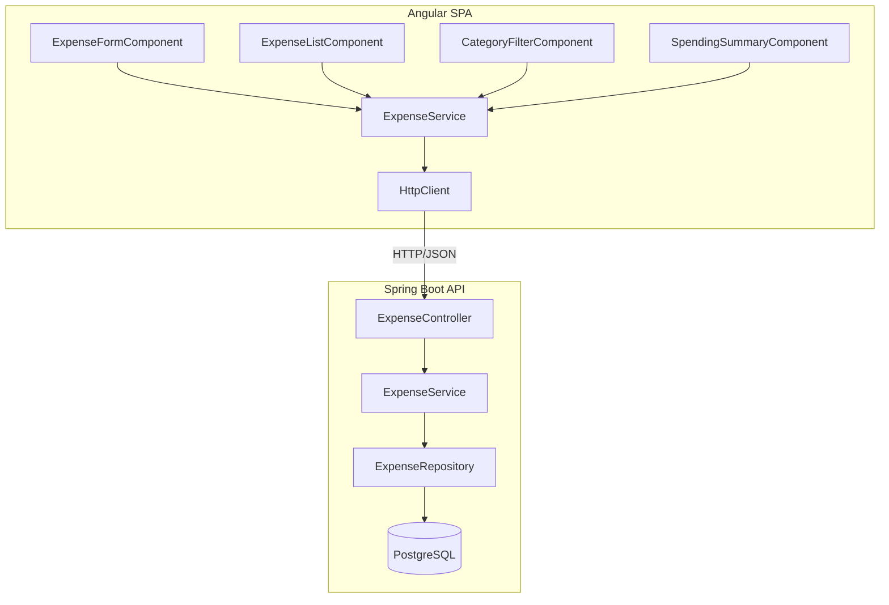

# Design Document: Budget Tracker

## Overview

Budget Tracker is a full-stack expense tracking application consisting of a Spring Boot REST API backend connected to PostgreSQL and an Angular single-page application frontend. The system allows users to create, read, update, and delete expense records, filter by category, and view spending summaries grouped by category. There is no authentication or pagination.

The architecture follows a standard three-tier pattern: Angular SPA communicates with the Spring Boot REST API over HTTP/JSON, and the API persists data to PostgreSQL via Spring Data JPA.

## Architecture



### Technology Choices

| Layer | Technology | Rationale |
|-------|-----------|-----------|
| Backend Runtime | Spring Boot 3.x (Java 17+) | Mature framework with excellent JPA/REST support |
| ORM | Spring Data JPA / Hibernate | Declarative repository pattern, automatic query generation |
| Database | PostgreSQL | Robust relational DB, excellent numeric precision |
| Frontend Framework | Angular 17+ | Component-based SPA framework with built-in HttpClient and reactive forms |
| Styling | Angular Material or basic CSS | Per Requirement 12, keep dependencies minimal |
| Build | Maven (backend), Angular CLI (frontend) | Standard tooling for each ecosystem |

### Communication Pattern

- Frontend communicates with backend exclusively via REST/JSON over HTTP
- No WebSockets or server-sent events required
- All API calls are stateless (no session management)
- CORS configuration on the backend to allow requests from the Angular dev server

## Components and Interfaces

### Backend Components

#### ExpenseController

REST controller handling all `/expenses` endpoints.

```java
@RestController
@RequestMapping("/expenses")
public class ExpenseController {

    // POST /expenses - Create expense (returns 201)
    @PostMapping
    public ResponseEntity<ExpenseResponse> createExpense(@Valid @RequestBody ExpenseRequest request);

    // GET /expenses - List all expenses, optional ?category= filter
    @GetMapping
    public ResponseEntity<List<ExpenseResponse>> listExpenses(
        @RequestParam(required = false) String category);

    // GET /expenses/summary - Spending summary by category
    @GetMapping("/summary")
    public ResponseEntity<List<CategorySummary>> getSummary();

    // PUT /expenses/{id} - Update expense
    @PutMapping("/{id}")
    public ResponseEntity<ExpenseResponse> updateExpense(
        @PathVariable Long id, @Valid @RequestBody ExpenseRequest request);

    // DELETE /expenses/{id} - Delete expense (returns 204)
    @DeleteMapping("/{id}")
    public ResponseEntity<Void> deleteExpense(@PathVariable Long id);
}
```

#### ExpenseService

Business logic layer responsible for validation orchestration, CRUD operations, and summary computation.

```java
@Service
public class ExpenseService {

    Expense createExpense(ExpenseRequest request);
    List<Expense> listExpenses(String category);
    List<CategorySummary> getSummary();
    Expense updateExpense(Long id, ExpenseRequest request);
    void deleteExpense(Long id);
}
```

#### ExpenseRepository

Spring Data JPA repository providing data access.

```java
@Repository
public interface ExpenseRepository extends JpaRepository<Expense, Long> {

    List<Expense> findByCategoryOrderByDateDesc(String category);
    List<Expense> findAllByOrderByDateDesc();

    @Query("SELECT new com.budgettracker.dto.CategorySummary(e.category, SUM(e.amount)) " +
           "FROM Expense e GROUP BY e.category")
    List<CategorySummary> findCategorySummaries();
}
```

#### GlobalExceptionHandler

Centralized exception handling via `@ControllerAdvice`.

```java
@ControllerAdvice
public class GlobalExceptionHandler {

    @ExceptionHandler(MethodArgumentNotValidException.class)
    public ResponseEntity<ErrorResponse> handleValidationErrors(...);

    @ExceptionHandler(ExpenseNotFoundException.class)
    public ResponseEntity<ErrorResponse> handleNotFound(...);

    @ExceptionHandler(InvalidParameterException.class)
    public ResponseEntity<ErrorResponse> handleBadRequest(...);

    @ExceptionHandler(Exception.class)
    public ResponseEntity<ErrorResponse> handleInternalError(...);
}
```

### Frontend Components

#### ExpenseFormComponent

- Displays input fields for amount, category, date, and description
- Uses Angular Reactive Forms with validators for required fields and amount range
- On submit: calls `ExpenseService.create()`, on success clears form and triggers list refresh
- On API error: displays error message, preserves form data
- Inline validation errors shown when user touches a required field and leaves it empty

#### ExpenseListComponent

- Subscribes to expense data from `ExpenseService`
- Renders each expense showing amount, category, date, description
- Provides delete button per row (calls `ExpenseService.delete()`)
- Provides edit action per row (toggles inline edit mode or opens pre-filled form)
- Shows empty-state message when no expenses exist

#### CategoryFilterComponent

- Dropdown/select populated with distinct categories from current expenses
- Defaults to "All Categories" on page load
- On selection: triggers `ExpenseService.list(category)` which re-fetches filtered data
- On clear: resets to all expenses

#### SpendingSummaryComponent

- Displays table/list of category totals fetched from `/expenses/summary`
- Formats amounts to two decimal places
- Sorted alphabetically by category name
- Hidden when no expenses exist (shows empty-state message instead)
- Refreshes after any create/update/delete operation

#### ExpenseService (Frontend)

Angular service encapsulating all HTTP communication.

```typescript
@Injectable({ providedIn: 'root' })
export class ExpenseService {
  private apiUrl = '/api/expenses';

  getAll(): Observable<Expense[]>;
  getByCategory(category: string): Observable<Expense[]>;
  getSummary(): Observable<CategorySummary[]>;
  create(expense: ExpenseRequest): Observable<Expense>;
  update(id: number, expense: ExpenseRequest): Observable<Expense>;
  delete(id: number): Observable<void>;
}
```

### API Contracts

#### Request/Response DTOs

**ExpenseRequest** (POST/PUT body):
```json
{
  "amount": 42.50,
  "category": "Groceries",
  "date": "2024-01-15",
  "description": "Weekly shopping"
}
```

**ExpenseResponse** (returned from POST/PUT/GET):
```json
{
  "id": 1,
  "amount": 42.50,
  "category": "Groceries",
  "date": "2024-01-15",
  "description": "Weekly shopping",
  "createdAt": "2024-01-15T10:30:00Z"
}
```

**CategorySummary** (from GET /expenses/summary):
```json
{
  "category": "Groceries",
  "totalAmount": 285.00
}
```

**ErrorResponse** (on 400/404/500):
```json
{
  "status": 400,
  "message": "Validation failed",
  "errors": ["amount: must be between 0.01 and 999999999.99"]
}
```

#### Endpoint Summary

| Method | Path | Status Codes | Description |
|--------|------|-------------|-------------|
| POST | /expenses | 201, 400 | Create expense |
| GET | /expenses | 200, 400, 500 | List/filter expenses |
| GET | /expenses/summary | 200, 500 | Spending summary |
| PUT | /expenses/{id} | 200, 400, 404 | Update expense |
| DELETE | /expenses/{id} | 204, 400, 404 | Delete expense |

## Data Models

### Expense Entity (JPA)

```java
@Entity
@Table(name = "expenses")
public class Expense {

    @Id
    @GeneratedValue(strategy = GenerationType.IDENTITY)
    private Long id;

    @Column(nullable = false, precision = 12, scale = 2)
    private BigDecimal amount;

    @Column(nullable = false, length = 50)
    private String category;

    @Column(nullable = false)
    private LocalDate date;

    @Column(length = 255)
    private String description;

    @Column(name = "created_at", nullable = false, updatable = false)
    private Instant createdAt;

    @PrePersist
    protected void onCreate() {
        this.createdAt = Instant.now();
    }
}
```

### Database Schema

```sql
CREATE TABLE expenses (
    id          BIGSERIAL PRIMARY KEY,
    amount      NUMERIC(12, 2) NOT NULL,
    category    VARCHAR(50) NOT NULL,
    date        DATE NOT NULL,
    description VARCHAR(255),
    created_at  TIMESTAMP WITH TIME ZONE NOT NULL DEFAULT NOW()
);
```

Design decisions:
- `BIGSERIAL` for auto-incrementing primary key (maps to JPA `GenerationType.IDENTITY`)
- `NUMERIC(12, 2)` provides precision for amounts up to 999,999,999.99 with exactly 2 decimal places
- `VARCHAR(50)` for category enforces the 1-50 character constraint at DB level
- `TIMESTAMP WITH TIME ZONE` for `created_at` ensures UTC storage
- `@PrePersist` callback auto-populates `created_at` on insert
- `updatable = false` on `created_at` prevents modification on update

### Frontend Models (TypeScript)

```typescript
export interface Expense {
  id: number;
  amount: number;
  category: string;
  date: string; // ISO 8601 date string
  description?: string;
  createdAt: string; // ISO 8601 timestamp
}

export interface ExpenseRequest {
  amount: number;
  category: string;
  date: string;
  description?: string;
}

export interface CategorySummary {
  category: string;
  totalAmount: number;
}

export interface ErrorResponse {
  status: number;
  message: string;
  errors?: string[];
}
```

## Correctness Properties

*A property is a characteristic or behavior that should hold true across all valid executions of a system — essentially, a formal statement about what the system should do. Properties serve as the bridge between human-readable specifications and machine-verifiable correctness guarantees.*

### Property 1: Create-then-retrieve round trip

*For any* valid expense request (amount between 0.01 and 999,999,999.99, non-empty category of 1-50 chars, valid ISO 8601 date, optional description), creating the expense via POST and then retrieving all expenses via GET SHALL return a list containing an expense whose amount, category, date, and description fields exactly match the original request, plus a non-null unique id and a non-null created_at timestamp.

**Validates: Requirements 1.1, 1.5, 2.1**

### Property 2: Invalid expense rejection preserves state

*For any* expense request that violates at least one validation rule (missing amount/category/date, amount outside 0.01–999,999,999.99, invalid date format, or category length outside 1–50 characters), submitting it via POST or PUT SHALL return HTTP 400, and the total count of persisted expenses SHALL remain unchanged.

**Validates: Requirements 1.2, 1.3, 1.4, 1.6, 3.3, 3.4, 3.5**

### Property 3: Category filter returns correct subset

*For any* set of persisted expenses and any category value C present in that set, a GET request with `?category=C` SHALL return exactly those expenses whose category equals C, and no others. The count of filtered results SHALL equal the count of expenses with category C in the full unfiltered list.

**Validates: Requirements 2.2, 2.3**

### Property 4: Summary totals equal sum of individual amounts

*For any* set of persisted expenses, each entry in the summary response SHALL have a totalAmount equal to the sum of all amount values of expenses sharing that category, rounded to exactly two decimal places. The set of categories in the summary SHALL exactly equal the set of distinct categories present in the expenses.

**Validates: Requirements 5.1, 5.3, 5.4**

### Property 5: Update preserves created_at and modifies content

*For any* existing expense and any valid update payload, after a PUT request, the returned expense SHALL have the same id and created_at as before the update, while the amount, category, date, and description fields SHALL equal the values from the update payload.

**Validates: Requirements 3.1, 3.6**

### Property 6: Delete removes exactly one expense

*For any* non-empty set of persisted expenses and any valid expense id from that set, a DELETE request for that id SHALL reduce the total expense count by exactly one, and the deleted id SHALL no longer appear in subsequent GET responses.

**Validates: Requirements 4.1**

### Property 7: Expenses are sorted by date descending

*For any* set of expenses returned by the list endpoint (with or without a category filter), for every consecutive pair (expense[i], expense[i+1]) in the response array, expense[i].date SHALL be greater than or equal to expense[i+1].date.

**Validates: Requirements 2.5**

## Error Handling

### Backend Error Strategy

| Scenario | HTTP Status | Response Body |
|----------|------------|---------------|
| Missing required fields | 400 | ErrorResponse with field-specific messages |
| Amount out of range | 400 | ErrorResponse with range message |
| Invalid date format | 400 | ErrorResponse with format message |
| Category too long/empty | 400 | ErrorResponse with length message |
| Empty category query param | 400 | ErrorResponse with non-empty message |
| Invalid id format | 400 | ErrorResponse with format message |
| Expense not found | 404 | ErrorResponse with not-found message |
| Database/internal error | 500 | ErrorResponse with generic failure message |

**Implementation approach:**
- Use `@Valid` annotation with Bean Validation (Jakarta Validation) annotations on the request DTO
- Custom validators for amount range and date format where standard annotations are insufficient
- `@ControllerAdvice` global exception handler translates exceptions to consistent ErrorResponse format
- Never expose stack traces or internal details in error responses
- Log full exception details server-side at ERROR level for 500s

### Frontend Error Strategy

- HTTP errors from the API are caught in the Angular service layer
- 400 errors: display the specific validation message from the API response to the user
- 404 errors: display "Expense not found" and refresh the list (expense may have been deleted)
- 500 errors: display a generic "Something went wrong, please try again" message
- Network errors: display "Unable to connect to server" message
- Form validation errors are shown inline next to each field in real-time (on touch/blur)
- Error messages are dismissible and do not block further interaction

## Testing Strategy

### Backend Testing

**Unit Tests (JUnit 5 + Mockito):**
- Controller layer: test request mapping, validation, response codes using `@WebMvcTest`
- Service layer: test business logic with mocked repository
- Edge cases: boundary amounts (0.01, 999999999.99), empty/max-length categories, null descriptions

**Integration Tests (Spring Boot Test + Testcontainers):**
- Full request lifecycle against a real PostgreSQL instance in a container
- Verify JPA entity mapping, constraints, and query behavior
- Test CORS configuration
- Test error responses for end-to-end validation flow

**Property-Based Tests (jqwik):**
- Library: [jqwik](https://jqwik.net/) — JUnit 5 compatible PBT library for Java
- Minimum 100 iterations per property test
- Each test is tagged with the design property it validates
- Tag format: **Feature: budget-tracker, Property {number}: {property_text}**
- Generators produce random valid and invalid expense requests to exercise:
  - Round-trip creation and retrieval (Property 1)
  - Validation rejection invariants (Property 2)
  - Category filter correctness (Property 3)
  - Summary aggregation accuracy and category coverage (Property 4)
  - Update immutability of created_at (Property 5)
  - Delete count invariant (Property 6)
  - Sort order invariant (Property 7)

### Frontend Testing

**Unit Tests (Jasmine + Karma or Jest):**
- Component tests: form validation, list rendering, filter behavior, summary display
- Service tests: HTTP call construction, error handling
- Mock HttpClient responses for isolated component testing

**End-to-End Tests (optional, Cypress or Playwright):**
- Full workflow: add expense → verify in list → filter → check summary → edit → delete
- Verify empty-state messages

### Test Organization

```
backend/
  src/test/java/
    unit/        - controller, service unit tests
    integration/ - full Spring Boot integration tests
    property/    - jqwik property-based tests

frontend/
  src/app/
    *.spec.ts    - component and service unit tests
  e2e/           - end-to-end tests (if included)
```
