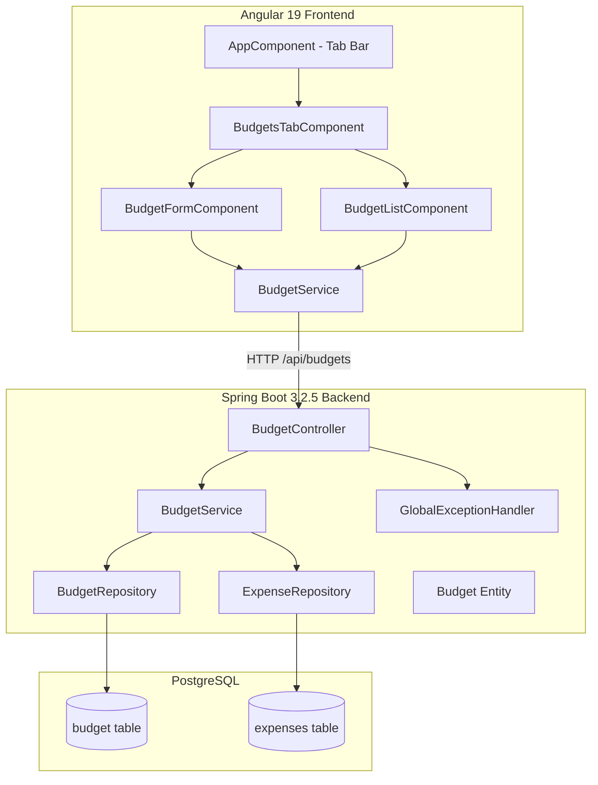
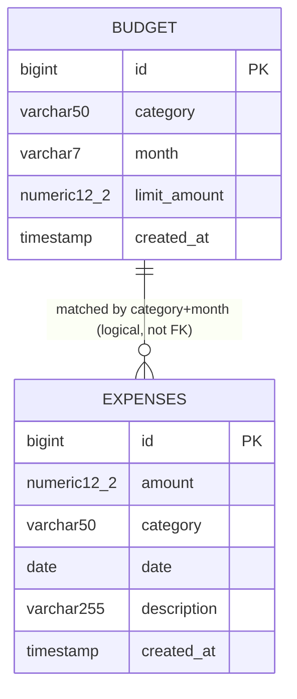

# Design Document: Budgets Module

## Overview

The Budgets Module adds monthly spending-limit tracking to the Budget Tracker application. It introduces a new `Budget` entity with CRUD operations exposed via a REST API at `/budgets`, a computed budget-status endpoint at `/budgets/status` that compares budgeted limits to actual expenses, and a frontend Budgets tab with form and list components.

The design follows the same layered architecture already established in the project: Controller → Service → Repository, with DTOs for request/response, jakarta.validation for input constraints, and the existing `GlobalExceptionHandler` for error formatting. The frontend mirrors existing patterns using standalone Angular components, Angular HttpClient with the `/api` proxy prefix, and RxJS observables.

### Key Design Decisions

1. **YearMonth stored as VARCHAR(7)**: JPA does not natively support `java.time.YearMonth`. The entity stores it as a `varchar(7)` column in YYYY-MM format and uses an `@Convert` JPA AttributeConverter for transparent mapping.
2. **Case-insensitive category matching**: Budget-status spend calculations use case-insensitive comparison (`LOWER()` in JPQL) to match expenses to budgets.
3. **Unique constraint at DB level**: A composite unique index on `(category, month)` enforces business rule against duplicate budgets; the service layer catches `DataIntegrityViolationException` to return 409.
4. **Tab-based navigation without routing**: Since the app has no Angular Router, tabs are switched via a simple boolean/string state in `AppComponent`.

## Architecture



### Request Flow

1. Angular component calls `BudgetService` (frontend).
2. `BudgetService` makes HTTP request to `/api/budgets/*` (proxied to `http://localhost:8080/budgets/*`).
3. `BudgetController` validates input via `@Valid`, delegates to `BudgetService` (backend).
4. `BudgetService` (backend) performs business logic, queries `BudgetRepository` and `ExpenseRepository` as needed.
5. Response DTO is serialized and returned through the controller.
6. Errors are caught by `GlobalExceptionHandler` or controller-specific handling, returned as `ErrorResponse`.

## Components and Interfaces

### Backend Components

#### BudgetController (`com.budgettracker.controller.BudgetController`)

| Method | Endpoint | Description |
|--------|----------|-------------|
| `POST` | `/budgets` | Create a new budget |
| `GET` | `/budgets` | List all budgets |
| `PUT` | `/budgets/{id}` | Update an existing budget |
| `DELETE` | `/budgets/{id}` | Delete a budget |
| `GET` | `/budgets/status` | Get budget status with spend calculations |

#### BudgetService (`com.budgettracker.service.BudgetService`)

```java
public interface BudgetService {
    BudgetResponse createBudget(BudgetRequest request);
    List<BudgetResponse> listBudgets();
    BudgetResponse updateBudget(Long id, BudgetRequest request);
    void deleteBudget(Long id);
    List<BudgetStatusResponse> getBudgetStatus();
}
```

#### BudgetRepository (`com.budgettracker.repository.BudgetRepository`)

```java
@Repository
public interface BudgetRepository extends JpaRepository<Budget, Long> {
    Optional<Budget> findByCategoryIgnoreCaseAndMonth(String category, YearMonth month);
}
```

#### ExpenseRepository (extension)

A new query method will be added to the existing `ExpenseRepository`:

```java
@Query("SELECT COALESCE(SUM(e.amount), 0) FROM Expense e " +
       "WHERE LOWER(e.category) = LOWER(:category) " +
       "AND YEAR(e.date) = :year AND MONTH(e.date) = :month")
BigDecimal sumAmountByCategoryAndMonth(
    @Param("category") String category,
    @Param("year") int year,
    @Param("month") int month);
```

#### DTOs

**BudgetRequest** (`com.budgettracker.dto.BudgetRequest`):
```java
public class BudgetRequest {
    @NotBlank(message = "category is required")
    @Size(max = 50, message = "category must be at most 50 characters")
    private String category;

    @NotNull(message = "month is required")
    @Pattern(regexp = "^\\d{4}-(0[1-9]|1[0-2])$", message = "month must be in YYYY-MM format")
    private String month;

    @NotNull(message = "limitAmount is required")
    @DecimalMin(value = "0.01", message = "limitAmount must be at least 0.01")
    private BigDecimal limitAmount;
}
```

**BudgetResponse** (`com.budgettracker.dto.BudgetResponse`):
```java
public class BudgetResponse {
    private Long id;
    private String category;
    private String month;        // YYYY-MM
    private BigDecimal limitAmount;
    private Instant createdAt;
}
```

**BudgetStatusResponse** (`com.budgettracker.dto.BudgetStatusResponse`):
```java
public class BudgetStatusResponse {
    private Long id;
    private String category;
    private String month;              // YYYY-MM
    private BigDecimal limitAmount;
    private BigDecimal actualSpend;
    private BigDecimal remainingAmount;
}
```

### Frontend Components

#### BudgetService (`src/app/services/budget.service.ts`)

```typescript
@Injectable({ providedIn: 'root' })
export class BudgetService {
  private apiUrl = '/api/budgets';

  getStatus(): Observable<BudgetStatus[]>;
  getAll(): Observable<Budget[]>;
  create(request: BudgetRequest): Observable<Budget>;
  update(id: number, request: BudgetRequest): Observable<Budget>;
  delete(id: number): Observable<void>;
}
```

#### Models (`src/app/models/budget.model.ts`)

```typescript
export interface Budget {
  id: number;
  category: string;
  month: string;         // YYYY-MM
  limitAmount: number;
  createdAt: string;     // ISO 8601 timestamp
}

export interface BudgetRequest {
  category: string;
  month: string;         // YYYY-MM
  limitAmount: number;
}

export interface BudgetStatus {
  id: number;
  category: string;
  month: string;         // YYYY-MM
  limitAmount: number;
  actualSpend: number;
  remainingAmount: number;
}
```

#### BudgetsTabComponent

- Standalone component containing `BudgetFormComponent` and `BudgetListComponent`.
- On init, fetches budget status from `/api/budgets/status`.
- Handles `budgetCreated`, `budgetDeleted`, and `budgetEdit` events by re-fetching status.
- Manages edit mode: when `budgetEdit` is received, populates form for editing.

#### BudgetFormComponent

- Reactive form with fields: category (text), month (month input), limitAmount (number).
- Validation: category required + max 50 chars, month required + YYYY-MM pattern, limitAmount required + min 0.01.
- Submits POST or PUT depending on edit mode.
- Emits `budgetCreated` / `budgetUpdated` events to parent.
- Displays API errors; disables submit button during request.

#### BudgetListComponent

- Receives `BudgetStatus[]` as `@Input()`.
- Displays tabular list with progress bars (width = min(actualSpend/limitAmount * 100, 100)%).
- Green styling when `remainingAmount >= 0`, red when `remainingAmount < 0`.
- Delete button per row; emits `budgetDeleted` on success.
- Edit button per row; emits `budgetEdit` with budget data.
- Empty state message when list is empty.

#### AppComponent Changes

- Add tab bar with "Expenses" and "Budgets" buttons.
- Conditionally render existing expense components or `BudgetsTabComponent` based on active tab.

## Data Models

### Budget Entity

```java
@Entity
@Table(name = "budget", uniqueConstraints = {
    @UniqueConstraint(columnNames = {"category", "month"})
})
public class Budget {
    @Id
    @GeneratedValue(strategy = GenerationType.IDENTITY)
    private Long id;

    @Column(nullable = false, length = 50)
    private String category;

    @Column(nullable = false, length = 7)
    @Convert(converter = YearMonthAttributeConverter.class)
    private YearMonth month;

    @Column(name = "limit_amount", nullable = false, precision = 12, scale = 2)
    private BigDecimal limitAmount;

    @Column(name = "created_at", nullable = false, updatable = false)
    private Instant createdAt;

    @PrePersist
    protected void onCreate() {
        this.createdAt = Instant.now();
    }
}
```

### YearMonthAttributeConverter

```java
@Converter(autoApply = true)
public class YearMonthAttributeConverter implements AttributeConverter<YearMonth, String> {
    @Override
    public String convertToDatabaseColumn(YearMonth yearMonth) {
        return yearMonth != null ? yearMonth.toString() : null;
    }

    @Override
    public YearMonth convertToEntityAttribute(String dbData) {
        return dbData != null ? YearMonth.parse(dbData) : null;
    }
}
```

### Database Schema

```sql
CREATE TABLE budget (
    id BIGINT GENERATED BY DEFAULT AS IDENTITY PRIMARY KEY,
    category VARCHAR(50) NOT NULL,
    month VARCHAR(7) NOT NULL,
    limit_amount NUMERIC(12, 2) NOT NULL,
    created_at TIMESTAMP NOT NULL,
    CONSTRAINT uq_budget_category_month UNIQUE (category, month)
);
```

### Entity Relationships



The relationship between budgets and expenses is logical (computed at query time via case-insensitive category match and year-month extraction from expense date), not enforced by a foreign key.


## Correctness Properties

*A property is a characteristic or behavior that should hold true across all valid executions of a system — essentially, a formal statement about what the system should do. Properties serve as the bridge between human-readable specifications and machine-verifiable correctness guarantees.*

### Property 1: YearMonth Converter Round-Trip

*For any* valid `YearMonth` value, converting it to a database column string via `YearMonthAttributeConverter.convertToDatabaseColumn` and then converting back via `convertToEntityAttribute` SHALL produce a `YearMonth` equal to the original.

**Validates: Requirements 1.6**

### Property 2: Budget Creation/Listing Round-Trip

*For any* valid `BudgetRequest` with a unique category+month combination, creating the budget via `BudgetService.createBudget` and then calling `BudgetService.listBudgets` SHALL return a list that contains an element with matching category, month, and limitAmount, and that element SHALL have a non-null id and createdAt.

**Validates: Requirements 1.1, 2.1, 2.3**

### Property 3: Duplicate Category+Month Rejection

*For any* two budget operations (create or update) that would result in a category+month combination that already exists on a different Budget entity (using case-insensitive category comparison), the `BudgetService` SHALL reject the second operation with a conflict indicator, and the total number of budgets for that category+month SHALL remain exactly one.

**Validates: Requirements 1.7, 3.4, 9.6**

### Property 4: Budget Deletion Exclusion

*For any* budget that has been successfully deleted via `BudgetService.deleteBudget`, subsequent calls to `BudgetService.listBudgets` and `BudgetService.getBudgetStatus` SHALL NOT include any element with that budget's id.

**Validates: Requirements 4.1, 4.4**

### Property 5: Budget Status Actual Spend Calculation

*For any* set of budgets and expenses, the `actual_spend` for a given budget SHALL equal the sum of all expense amounts where:
- The expense category matches the budget category using case-insensitive comparison (e.g., "Food", "food", "FOOD" all match), AND
- The year and month extracted from the expense date equal the budget's month year and month values.

All matching expense amounts SHALL be included regardless of whether they are positive, negative, or zero. When no expenses match, actual_spend SHALL be 0.00.

**Validates: Requirements 5.2, 5.5, 5.7, 10.1, 10.2, 10.3, 10.4, 10.5**

### Property 6: Remaining Amount Invariant

*For any* `BudgetStatusResponse` returned by `BudgetService.getBudgetStatus`, the `remainingAmount` SHALL exactly equal `limitAmount - actualSpend`, computed to 2 decimal places. When `actualSpend` exceeds `limitAmount`, `remainingAmount` SHALL be negative.

**Validates: Requirements 5.3, 5.4**

### Property 7: Progress Bar Percentage Calculation

*For any* budget status with `actualSpend >= 0` and `limitAmount > 0`, the progress bar percentage SHALL equal `min((actualSpend / limitAmount) * 100, 100)`. The percentage SHALL never exceed 100%.

**Validates: Requirements 7.2**

### Property 8: Over-Budget Styling Determination

*For any* budget status displayed in the Budget_List, if `remainingAmount < 0` then the over-budget style (red) SHALL be applied, and if `remainingAmount >= 0` then the normal style (green) SHALL be applied.

**Validates: Requirements 7.3, 7.4**

## Error Handling

### Backend Error Handling

The module leverages the existing `GlobalExceptionHandler` and extends it with budget-specific exception handling:

| Scenario | Exception | HTTP Status | Response |
|----------|-----------|-------------|----------|
| Validation failure | `MethodArgumentNotValidException` | 400 | `ErrorResponse` with field-level errors list |
| Budget not found | `BudgetNotFoundException` | 404 | `ErrorResponse` with message "Budget not found with id: {id}" |
| Duplicate category+month | `DuplicateBudgetException` | 409 | `ErrorResponse` with message indicating duplicate |
| Type mismatch (invalid id) | `MethodArgumentTypeMismatchException` | 400 | `ErrorResponse` with parameter name |
| Malformed JSON body | `HttpMessageNotReadableException` | 400 | `ErrorResponse` with "Malformed request body" |
| Unexpected server error | `Exception` | 500 | `ErrorResponse` with generic message |

#### New Exceptions

```java
public class BudgetNotFoundException extends RuntimeException {
    public BudgetNotFoundException(Long id) {
        super("Budget not found with id: " + id);
    }
}

public class DuplicateBudgetException extends RuntimeException {
    public DuplicateBudgetException(String category, String month) {
        super("A budget already exists for category '" + category + "' and month '" + month + "'");
    }
}
```

#### GlobalExceptionHandler Additions

```java
@ExceptionHandler(BudgetNotFoundException.class)
public ResponseEntity<ErrorResponse> handleBudgetNotFound(BudgetNotFoundException ex) {
    ErrorResponse response = new ErrorResponse(404, ex.getMessage(), null);
    return ResponseEntity.status(HttpStatus.NOT_FOUND).body(response);
}

@ExceptionHandler(DuplicateBudgetException.class)
public ResponseEntity<ErrorResponse> handleDuplicateBudget(DuplicateBudgetException ex) {
    ErrorResponse response = new ErrorResponse(409, ex.getMessage(), null);
    return ResponseEntity.status(HttpStatus.CONFLICT).body(response);
}
```

### Frontend Error Handling

| Scenario | Handling |
|----------|----------|
| Budget form API error (400, 409) | Display error message within form component |
| Budget list delete failure | Display inline error message on the failed row |
| Status endpoint failure/unreachable | Display error banner in BudgetsTab |
| Network timeout | Handled by Angular HttpClient; surfaces as error in Observable |

### Duplicate Detection Strategy

The service layer checks for duplicates proactively before persisting:
1. On create: query `BudgetRepository.findByCategoryIgnoreCaseAndMonth(category, month)` — if present, throw `DuplicateBudgetException`.
2. On update: query same method — if present AND the found budget's id differs from the one being updated, throw `DuplicateBudgetException`.
3. The database unique constraint serves as a safety net if a race condition bypasses the service check; `DataIntegrityViolationException` is caught and mapped to 409.

## Testing Strategy

### Property-Based Testing (jqwik)

The project already includes jqwik 1.8.4 and jqwik-spring 0.12.0 in `pom.xml`, with Maven Surefire configured to include `**/*Properties.java` files.

**Configuration:**
- Minimum 100 iterations per property test (jqwik default is 1000, which exceeds minimum)
- Each property test tagged with: `// Feature: budgets-module, Property {N}: {title}`
- Property test class: `BudgetProperties.java` in `src/test/java/com/budgettracker/`

**Properties to Implement:**

| Property | Test Class | Strategy |
|----------|------------|----------|
| P1: YearMonth Round-Trip | `YearMonthConverterProperties` | Generate random YearMonth via `@ForAll` with custom provider |
| P2: Creation/Listing Round-Trip | `BudgetServiceProperties` | Generate valid BudgetRequest, persist via service, verify in list |
| P3: Duplicate Rejection | `BudgetServiceProperties` | Generate two requests with same category+month (case variations), verify second fails |
| P4: Deletion Exclusion | `BudgetServiceProperties` | Create and delete, verify absence |
| P5: Actual Spend Calculation | `BudgetStatusProperties` | Generate budgets + expenses with varied categories/dates, verify sum |
| P6: Remaining Amount Invariant | `BudgetStatusProperties` | For any status result, verify remaining == limit - actual |
| P7: Progress Percentage | `BudgetListComponentProperties` | Generate random spend/limit pairs, verify calculation |
| P8: Styling Determination | `BudgetListComponentProperties` | Generate random remainingAmount values, verify class application |

### Unit Testing (JUnit 5 / Jasmine)

**Backend unit tests focus on:**
- Controller endpoint routing and HTTP status codes (specific examples)
- Validation error message formatting
- Not-found scenarios with specific IDs
- Type mismatch handling

**Frontend unit tests focus on:**
- Component rendering with mock data
- Form validation messages appear for specific invalid inputs
- Button states during async operations
- Event emission on success
- Error message display on failure
- Tab switching behavior

### Integration Testing

- `BudgetRepository` tests with H2 in-memory database (test profile)
- Verify unique constraint enforcement at DB level
- Verify `ExpenseRepository.sumAmountByCategoryAndMonth` query correctness
- Full controller integration tests via `@SpringBootTest` + `MockMvc`

### Test Balance

- **Property tests**: Cover universal correctness guarantees (data integrity, calculations, invariants)
- **Unit tests**: Cover specific examples, edge cases, error conditions, UI interactions
- **Integration tests**: Cover database constraints, query correctness, full HTTP request/response cycle

This dual approach ensures comprehensive coverage: property tests catch subtle logic errors across a wide input space, while unit/integration tests verify specific scenarios and infrastructure wiring.
